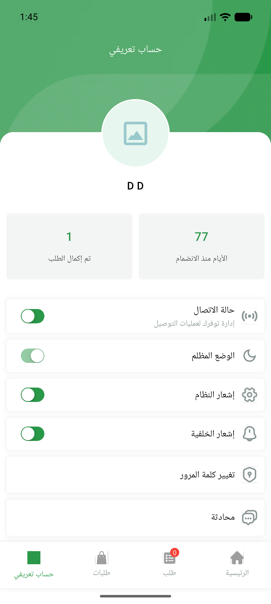

# QA Evidence — NEARS-887

**PASS (static gates) — getReferralDetails dead-code removal; grep-zero + analyze-clean; live Refer&Earn entry config-gated (Data DoR gap)**

**1 screenshot(s).** Click any thumbnail for full resolution.

<table>
<tr>
<td align="center" width="33%"> refer and earn entry config gated</td>
</tr>
</table>

---
*From `nears/docs/qa-evidence/NEARS-887/` · public-repo scrub policy (no live secrets; verified clean).*
