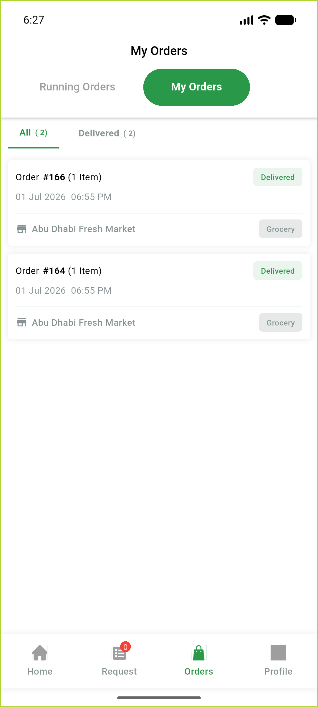

# QA Evidence — NEARS-889

**PASS — status-literal parity (byte-identical constants, live delivered-order surfaces clean, 202/202 tests)**

**2 screenshot(s).** Click any thumbnail for full resolution.

<table>
<tr>
<td align="center" width="33%"> ac a history delivered</td>
<td align="center" width="33%"> ac b details delivered</td>
</tr>
</table>

### Other artifacts
- [`progress.md`](progress.md)

---
*From `nears/docs/qa-evidence/NEARS-889/` · public-repo scrub policy (no live secrets; verified clean).*
