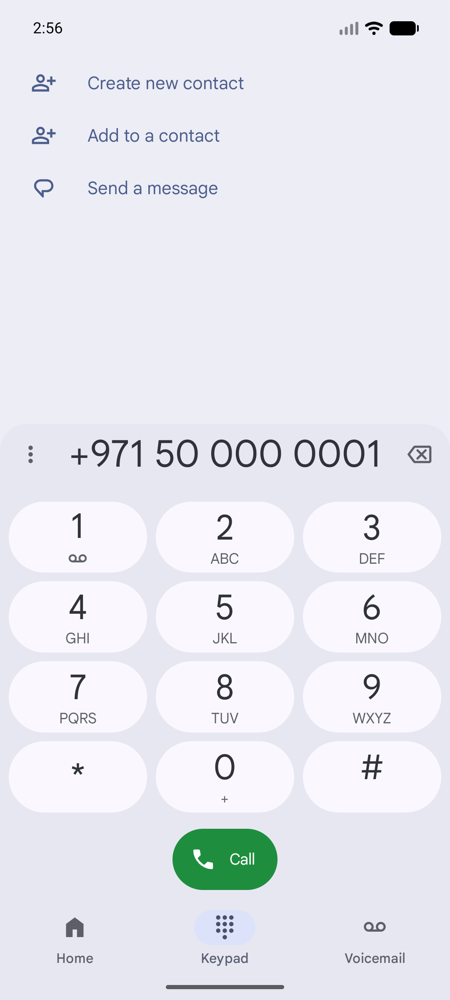

# QA Evidence — NEARS-891

**PASS — NEARS-891 DeliveryAddress null-coord guard: unit seam 3/3 + live normal-coords order detail clean**

**1 screenshot(s).** Click any thumbnail for full resolution.

<table>
<tr>
<td align="center" width="33%"> ac3 order detail normal coords live</td>
</tr>
</table>

### Other artifacts
- [`flutter-run.log`](flutter-run.log)
- [`unit-seam-fromjson-test.log`](unit-seam-fromjson-test.log)

---
*From `nears/docs/qa-evidence/NEARS-891/` · public-repo scrub policy (no live secrets; verified clean).*
