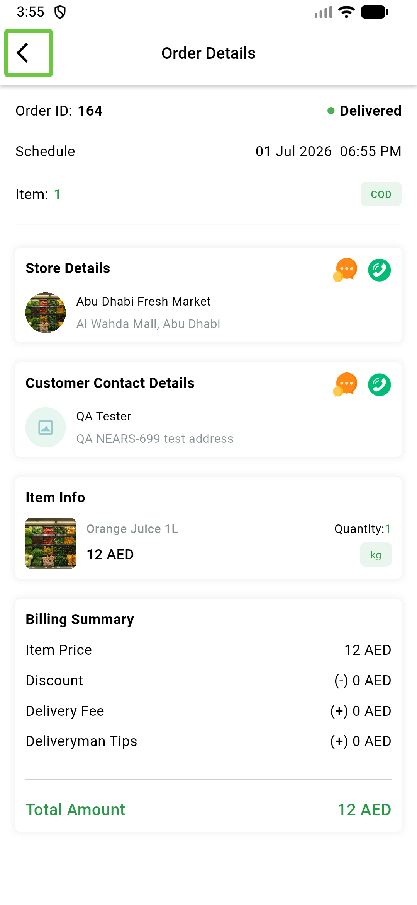

# QA Evidence — NEARS-892

**PASS — variation-guard: unit 7/7, pre-fix throws 2/2, live order-details renders clean, suite 198/198**

**1 screenshot(s).** Click any thumbnail for full resolution.

<table>
<tr>
<td align="center" width="33%"> ac2 order164 details render</td>
</tr>
</table>

### Other artifacts
- [`ac1-prefix-repro-proof.log`](ac1-prefix-repro-proof.log)

---
*From `nears/docs/qa-evidence/NEARS-892/` · public-repo scrub policy (no live secrets; verified clean).*
