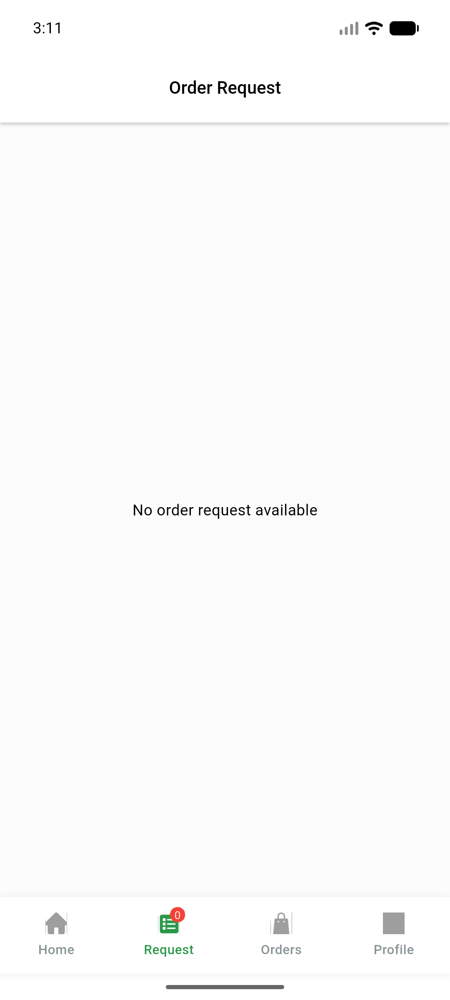

# QA Evidence — NEARS-893

**BUILD-QA PASS: Maps key build-time injection verified (binary+launch+regression); live tile raster blocked by Data DoR gap**

**1 screenshot(s).** Click any thumbnail for full resolution.

<table>
<tr>
<td align="center" width="33%"> ac3 app launched home</td>
</tr>
</table>

### Other artifacts
- [`ac3-key-injection-proof.log`](ac3-key-injection-proof.log)

---
*From `nears/docs/qa-evidence/NEARS-893/` · public-repo scrub policy (no live secrets; verified clean).*
