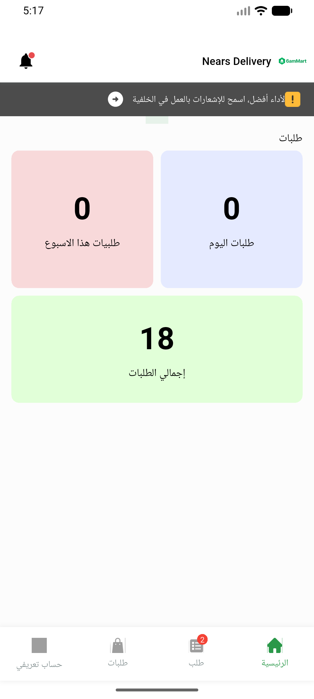
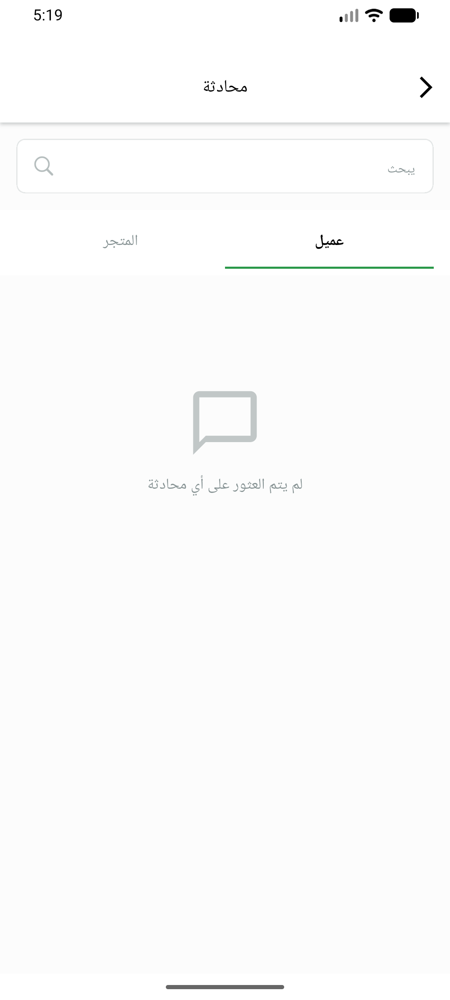
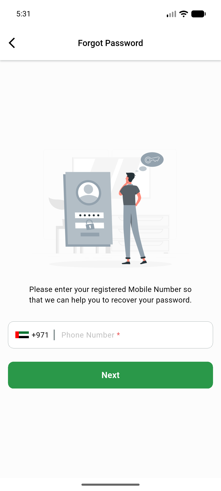
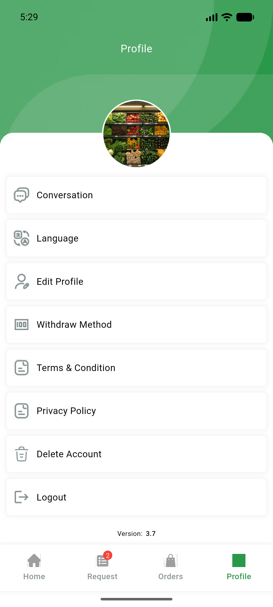
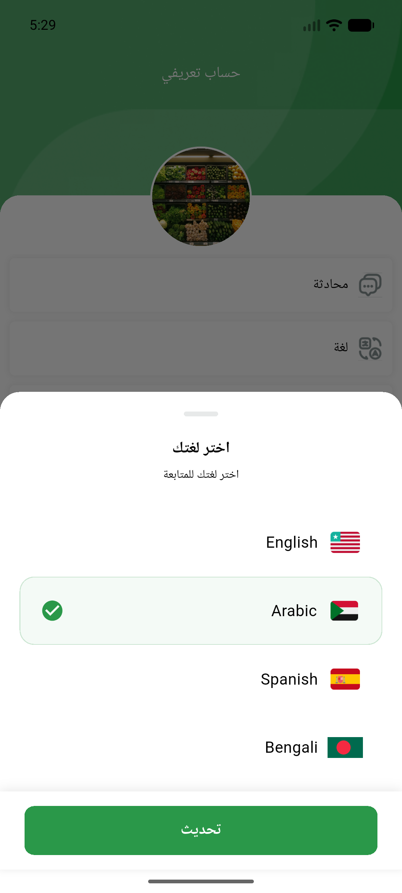
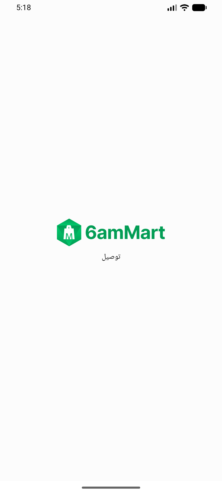
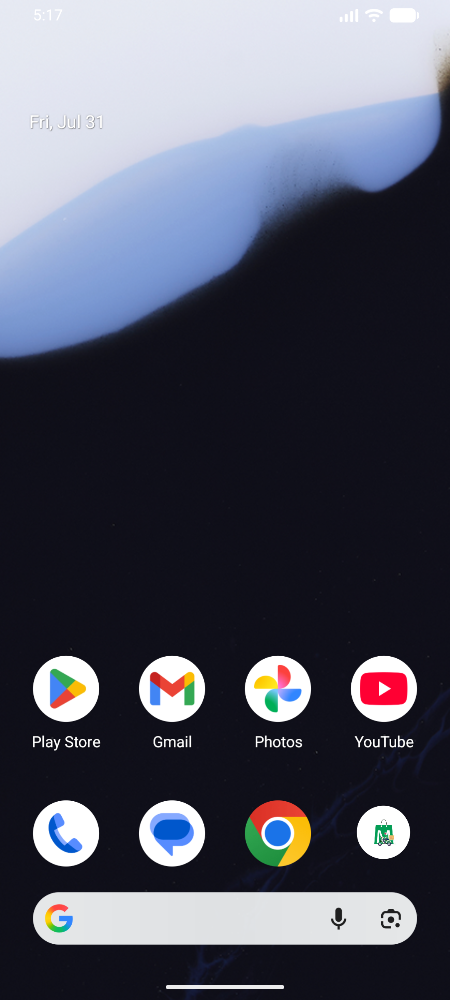
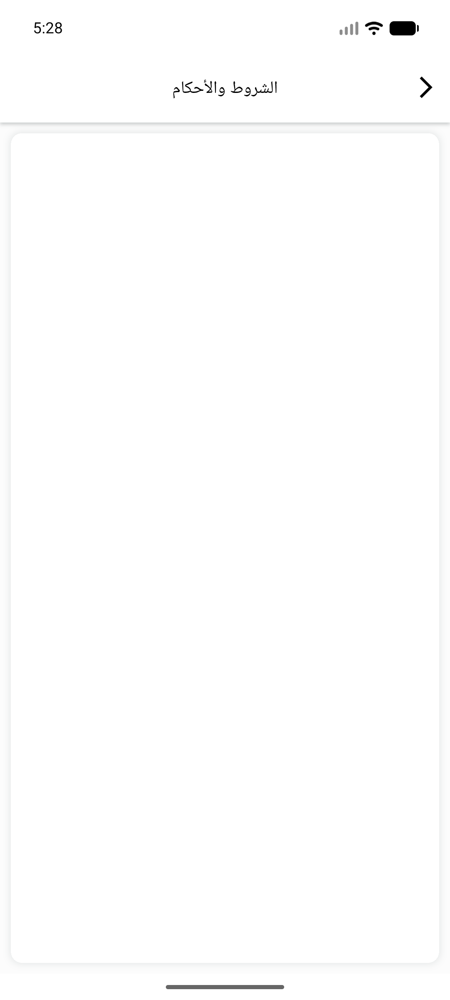
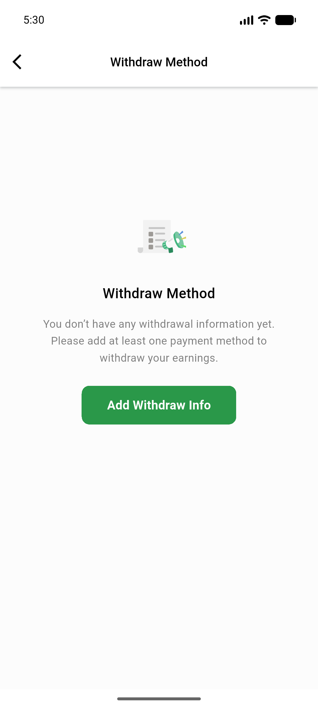

# QA Evidence — NEARS-895

**PASS — DeliveryApp get_di dedup: DI resolves, app boots + core flows work, no DI errors**

**9 screenshot(s).** Click any thumbnail for full resolution.

<table>
<tr>
<td align="center" width="33%"> ac1 home dashboard</td>
<td align="center" width="33%"> ac2 chat</td>
<td align="center" width="33%"> ac2 forgot password</td>
</tr>
<tr>
<td align="center" width="33%"> ac2 language english</td>
<td align="center" width="33%"> ac2 language</td>
<td align="center" width="33%"> ac2 order detail</td>
</tr>
<tr>
<td align="center" width="33%"> ac2 order list</td>
<td align="center" width="33%"> ac2 terms html</td>
<td align="center" width="33%"> ac2 withdraw disbursement</td>
</tr>
</table>

### Other artifacts
- [`progress.md`](progress.md)

---
*From `nears/docs/qa-evidence/NEARS-895/` · public-repo scrub policy (no live secrets; verified clean).*
