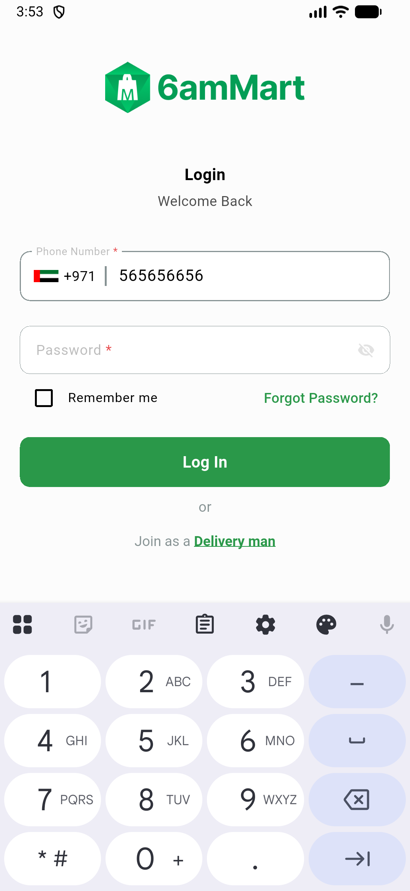

# QA Evidence — NEARS-898

**PASS — DeliveryApp native-shell drift: MainActivity resolves at com.izzes.nearsdelivery, dead BackgroundService gone, launch clean**

**1 screenshot(s).** Click any thumbnail for full resolution.

<table>
<tr>
<td align="center" width="33%"> ac4 launch first screen</td>
</tr>
</table>

---
*From `nears/docs/qa-evidence/NEARS-898/` · public-repo scrub policy (no live secrets; verified clean).*
