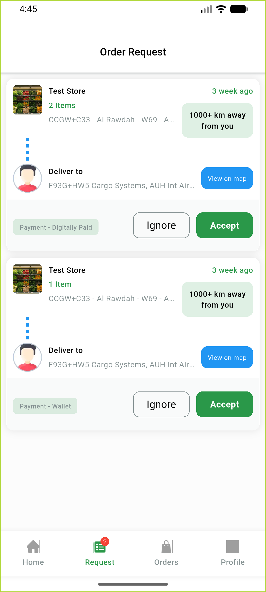
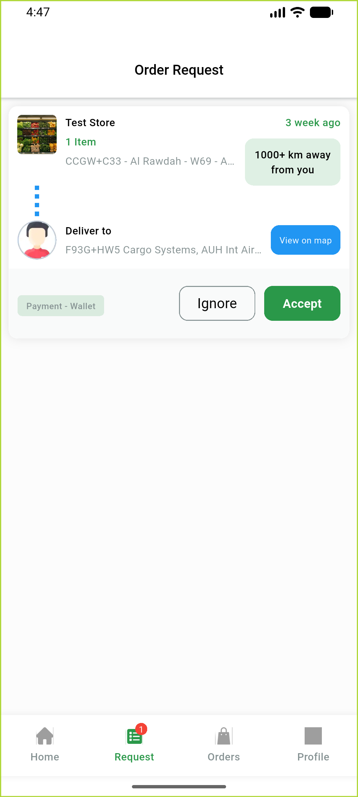
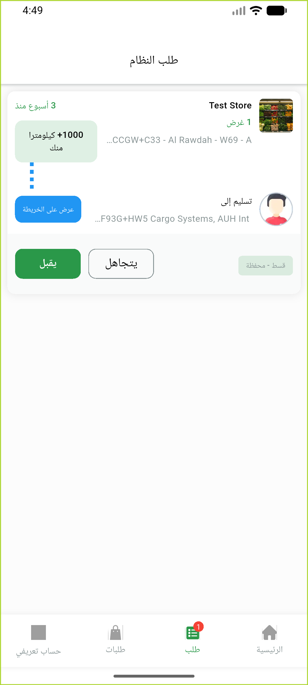

# QA Evidence — NEARS-899

**PASS — Accept/Ignore buttons 48dp live (LTR+RTL); accept/ignore dialogs intact**

**3 screenshot(s).** Click any thumbnail for full resolution.

<table>
<tr>
<td align="center" width="33%"> ac1 buttons 48dp ltr</td>
<td align="center" width="33%"> ac2 ac3 accept ignore dialogs</td>
<td align="center" width="33%"> ac4 buttons 48dp rtl arabic</td>
</tr>
</table>

---
*From `nears/docs/qa-evidence/NEARS-899/` · public-repo scrub policy (no live secrets; verified clean).*
