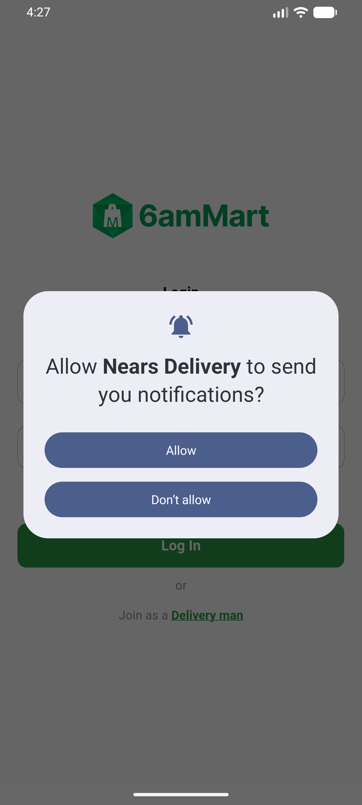

# QA Evidence — NEARS-900

**PASS — notif tray ids + explicit POST_NOTIFICATIONS verified (API 37)**

**1 screenshot(s).** Click any thumbnail for full resolution.

<table>
<tr>
<td align="center" width="33%"> ac2 runtime permission prompt</td>
</tr>
</table>

### Other artifacts
- [`ac1-merged-manifest.log`](ac1-merged-manifest.log)
- [`ac3-distinct-ids-unit-static.log`](ac3-distinct-ids-unit-static.log)
- [`ac4-routing-trace.log`](ac4-routing-trace.log)

---
*From `nears/docs/qa-evidence/NEARS-900/` · public-repo scrub policy (no live secrets; verified clean).*
