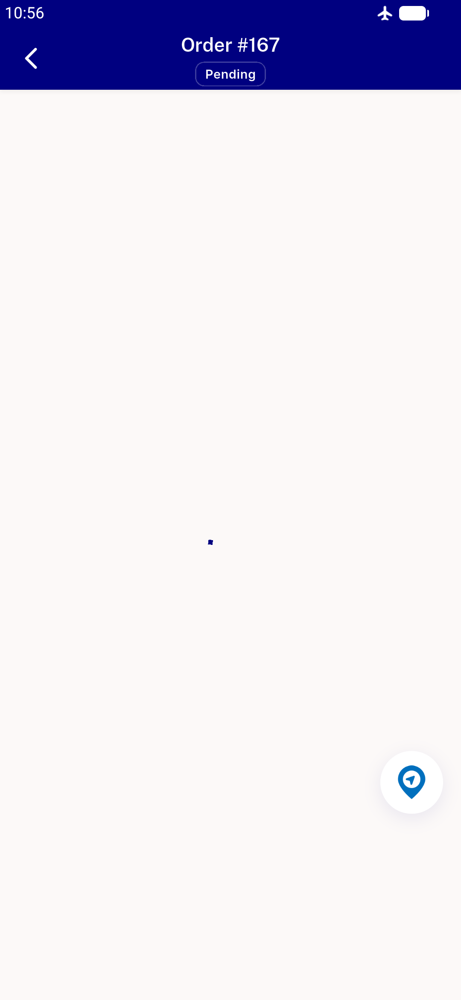
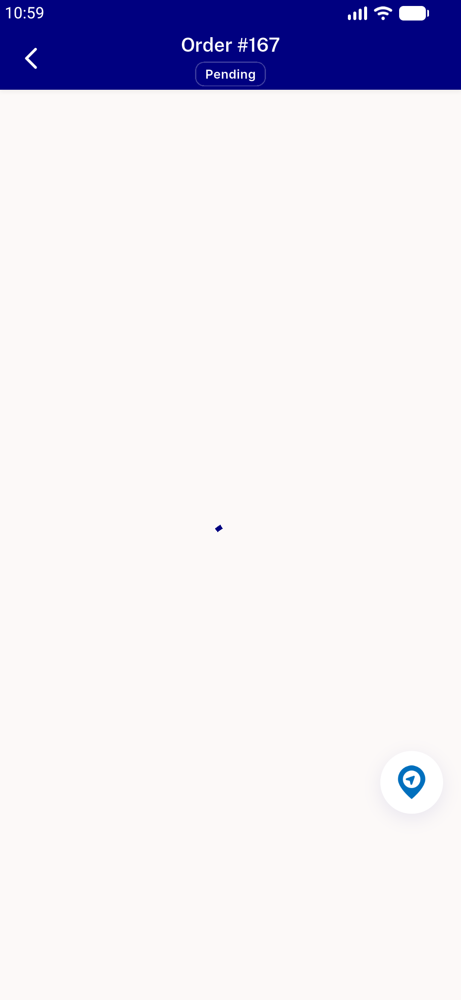

# QA Evidence — NEARS-907

**NEARS-715 regr-batch QA — NEARS-907**

**2 screenshot(s).** Click any thumbnail for full resolution.

<table>
<tr>
<td align="center" width="33%"> offline tracking rendered</td>
<td align="center" width="33%"> online tracking happy</td>
</tr>
</table>

### Other artifacts
- [`907-track-offline-then-online.log`](907-track-offline-then-online.log)

---
*From `nears/docs/qa-evidence/NEARS-907/` · public-repo scrub policy (no live secrets; verified clean).*
