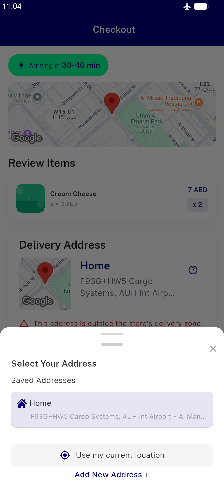
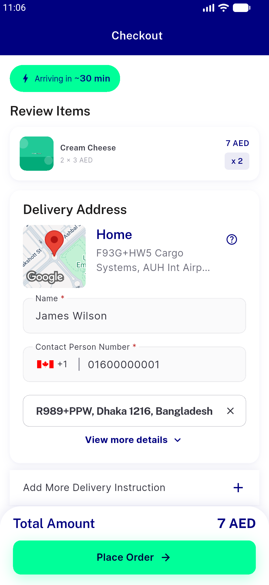

# QA Evidence — NEARS-908

**NEARS-715 regr-batch QA — NEARS-908**

**2 screenshot(s).** Click any thumbnail for full resolution.

<table>
<tr>
<td align="center" width="33%"> sheet offline loader closed sheet open</td>
<td align="center" width="33%"> sheet online success dismissed to checkout</td>
</tr>
</table>

### Other artifacts
- [`908-loc-fail-then-success.log`](908-loc-fail-then-success.log)

---
*From `nears/docs/qa-evidence/NEARS-908/` · public-repo scrub policy (no live secrets; verified clean).*
