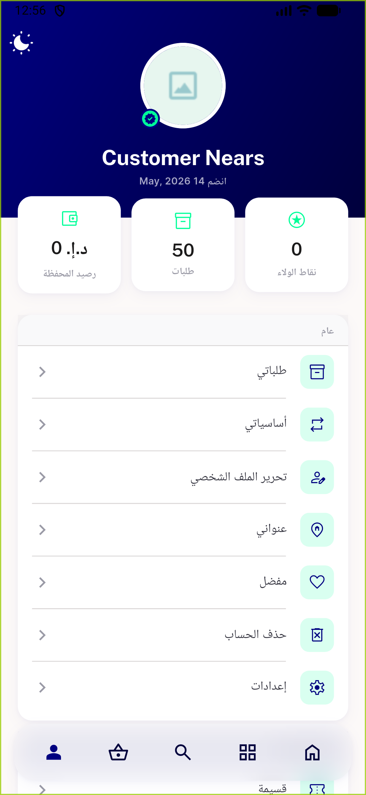
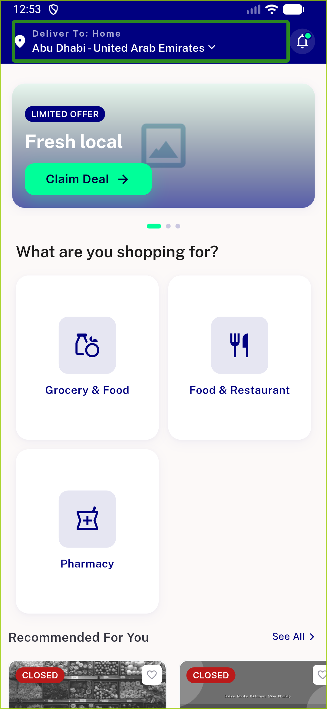
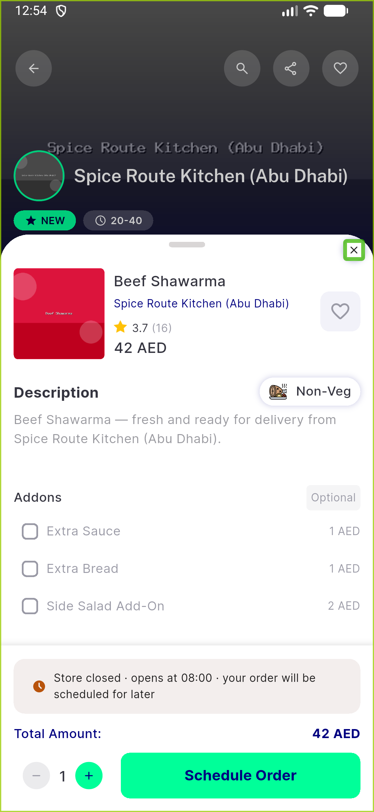
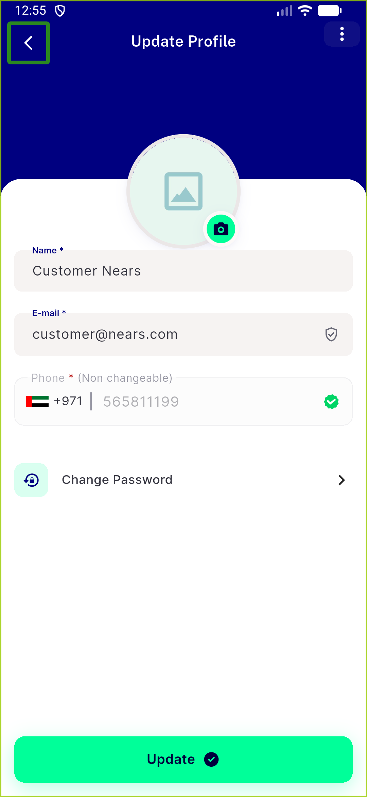

# QA Evidence — NEARS-927

**PASS — a11y icon labels (116 sites): automated 4/4 + 1848/1848, live TalkBack EN+AR confirmed**

**4 screenshot(s).** Click any thumbnail for full resolution.

<table>
<tr>
<td align="center" width="33%"> arabic labels</td>
<td align="center" width="33%"> home a11y labels</td>
<td align="center" width="33%"> item sheet favourite close</td>
</tr>
<tr>
<td align="center" width="33%"> update profile back kebab</td>
</tr>
</table>

---
*From `nears/docs/qa-evidence/NEARS-927/` · public-repo scrub policy (no live secrets; verified clean).*
