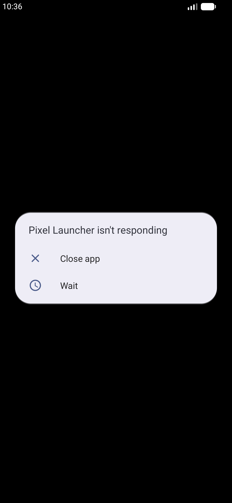

# QA Evidence — NEARS-929

**BLOCKED (infra) — AC4 backstop PASS + boot OK; live AC1/2/3 blocked by host resource starvation**

**1 screenshot(s).** Click any thumbnail for full resolution.

<table>
<tr>
<td align="center" width="33%"> boot userapp worktree home</td>
</tr>
</table>

### Other artifacts
- [`ac4-backstop.log`](ac4-backstop.log)

---
*From `nears/docs/qa-evidence/NEARS-929/` · public-repo scrub policy (no live secrets; verified clean).*
