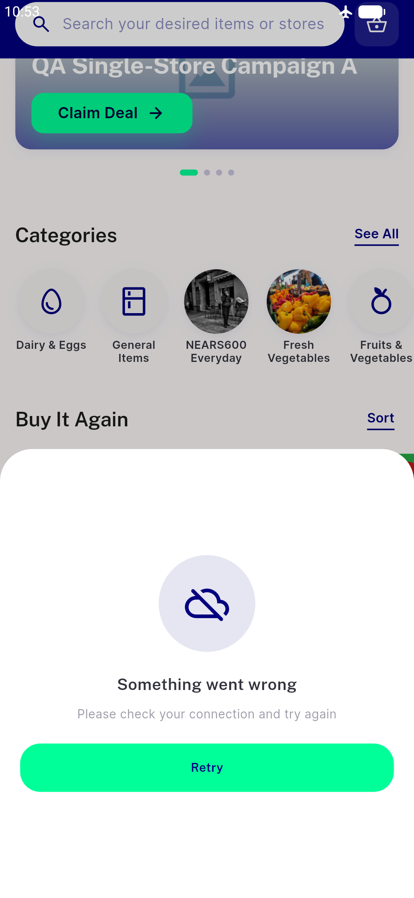

# QA Evidence — NEARS-947

**NEARS-715 regr-batch QA — NEARS-947**

**2 screenshot(s).** Click any thumbnail for full resolution.

<table>
<tr>
<td align="center" width="33%"> offline nearserrorretry</td>
<td align="center" width="33%"> retry success content</td>
</tr>
</table>

### Other artifacts
- [`947-fetch-fail-then-retry.log`](947-fetch-fail-then-retry.log)

---
*From `nears/docs/qa-evidence/NEARS-947/` · public-repo scrub policy (no live secrets; verified clean).*
