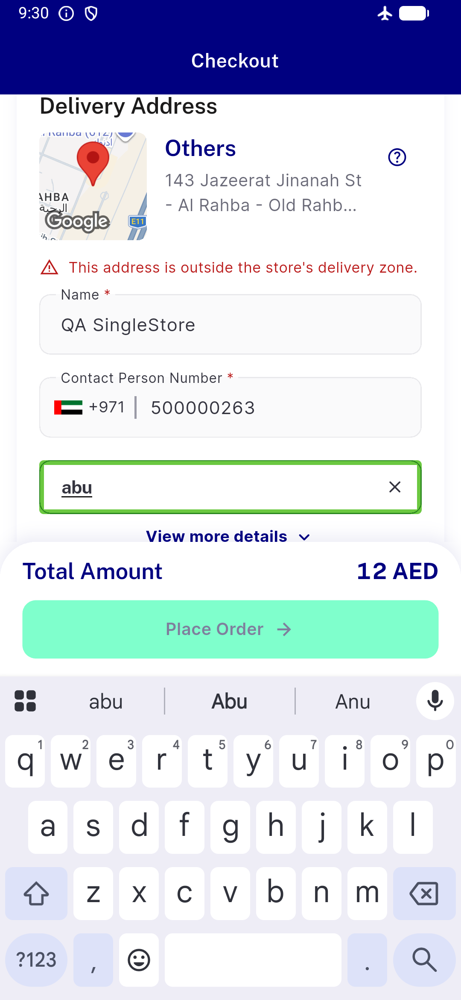
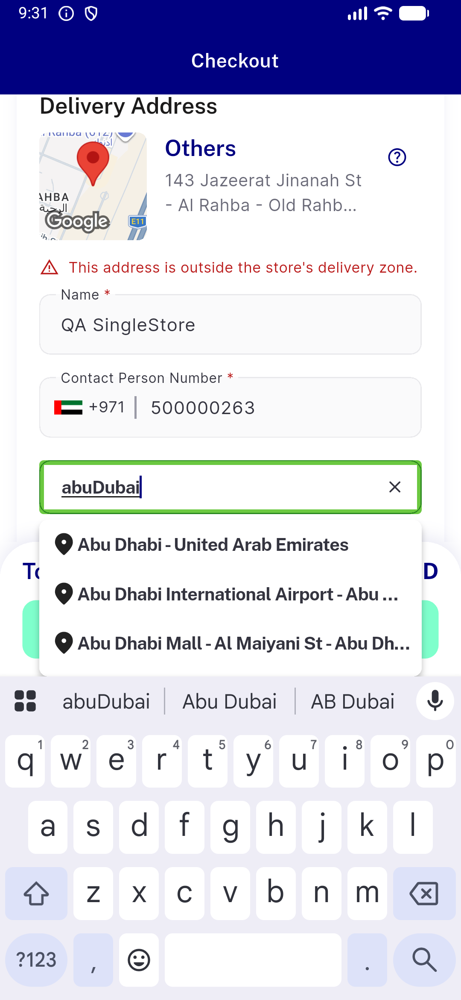
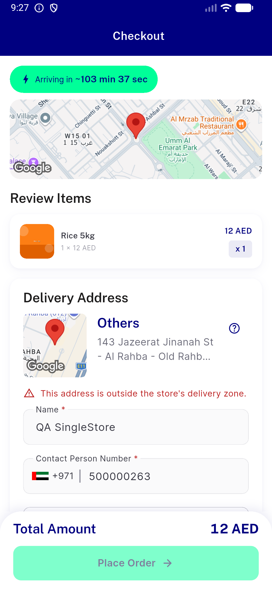
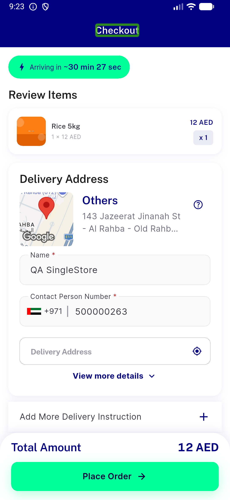
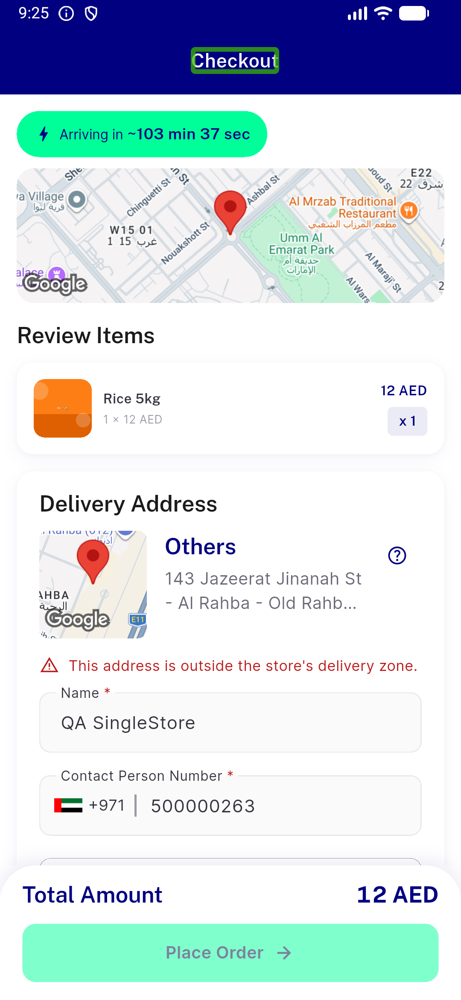
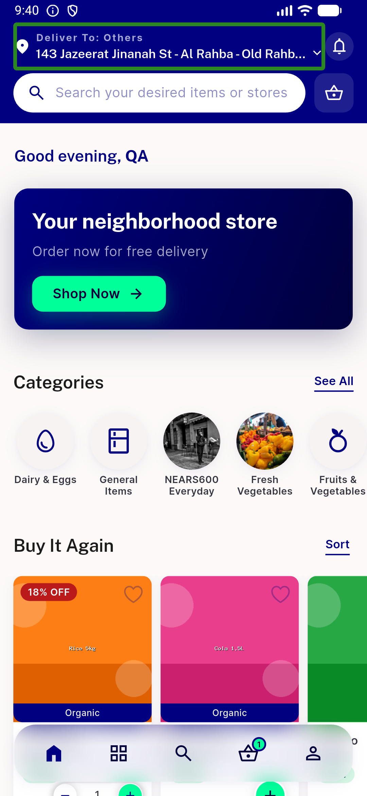
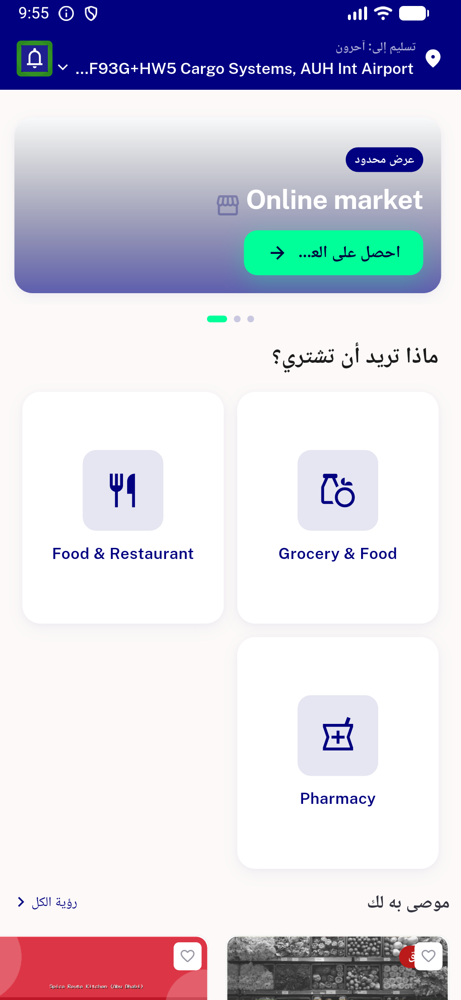

# QA Evidence — NEARS-954

**PASS — Wave-C loc/checkout cluster 954/955/958/956 (emulator-5560)**

**7 screenshot(s).** Click any thumbnail for full resolution.

<table>
<tr>
<td align="center" width="33%"> offline search no crash</td>
<td align="center" width="33%"> online search suggestions</td>
<td align="center" width="33%"> 955b checkout after unserviceable</td>
</tr>
<tr>
<td align="center" width="33%"> 955b checkout my location field</td>
<td align="center" width="33%"> 955b unserviceable nondismissible loader</td>
<td align="center" width="33%"> grocery module home</td>
</tr>
<tr>
<td align="center" width="33%"> rtl arabic home render</td>
</tr>
</table>

### Other artifacts
- [`qa-log-evidence.log`](qa-log-evidence.log)

---
*From `nears/docs/qa-evidence/NEARS-954/` · public-repo scrub policy (no live secrets; verified clean).*
