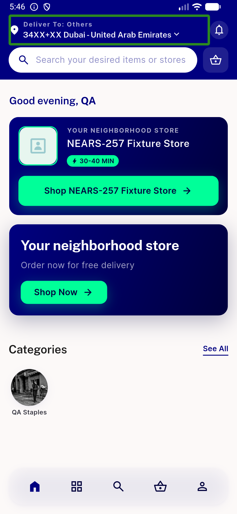
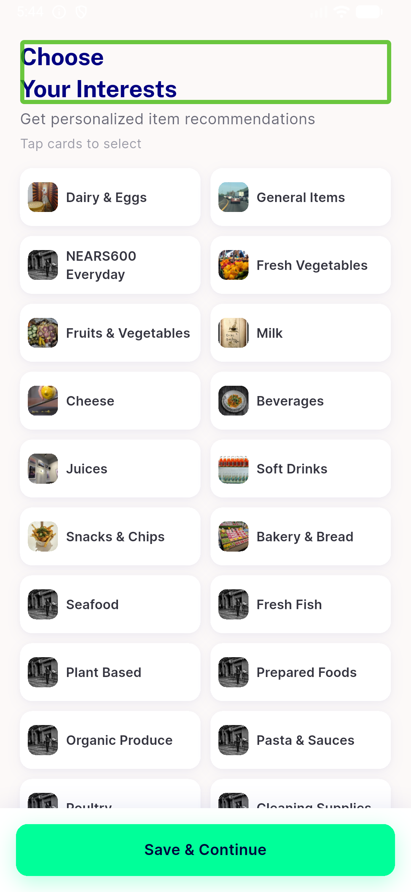
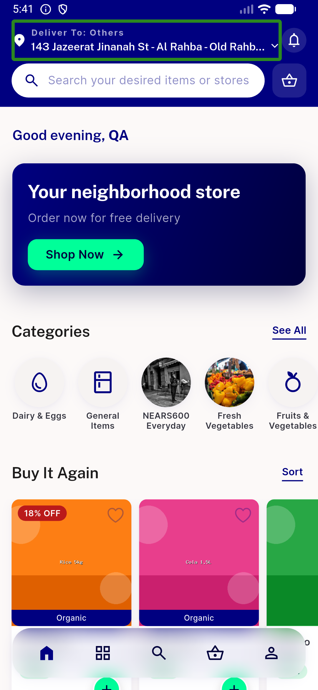
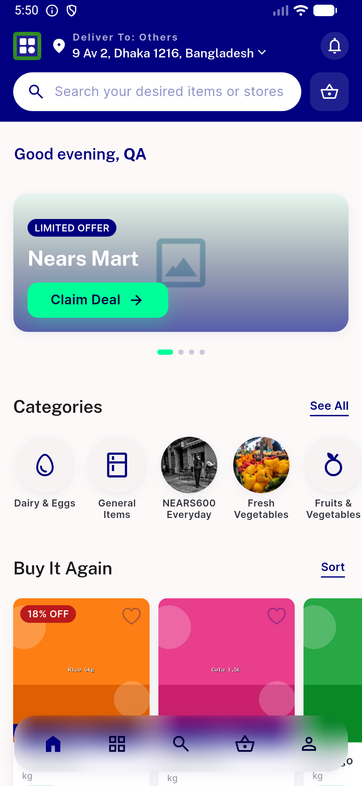
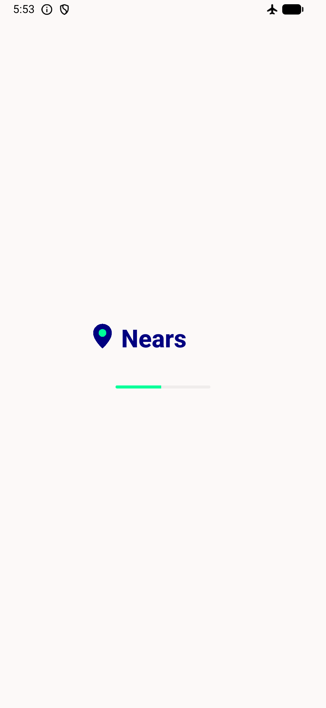

# QA Evidence — NEARS-960

**PASS — cold-open salvage re-fires full home block; rails populate in single-store (z3), single-module-multi-store (z453) & multi-module (z1); salvage line fired live in z3+z453; no regressions**

**9 screenshot(s).** Click any thumbnail for full resolution.

<table>
<tr>
<td align="center" width="33%"> ac1 zone3 coldopen populated</td>
<td align="center" width="33%"> ac1 zone3 salvage</td>
<td align="center" width="33%"> ac2 zone453 coldopen scrolled</td>
</tr>
<tr>
<td align="center" width="33%"> ac2 zone453 home items</td>
<td align="center" width="33%"> ac2 zone453 salvage top</td>
<td align="center" width="33%"> ac3 zone1 module selected</td>
</tr>
<tr>
<td align="center" width="33%"> ac3 zone1 multimodule</td>
<td align="center" width="33%"> regr offline coldopen</td>
<td align="center" width="33%"> regr rtl arabic home</td>
</tr>
</table>

---
*From `nears/docs/qa-evidence/NEARS-960/` · public-repo scrub policy (no live secrets; verified clean).*
