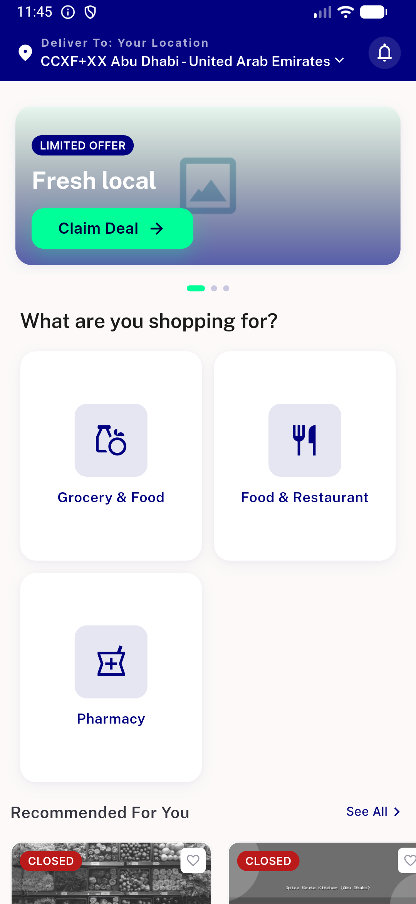
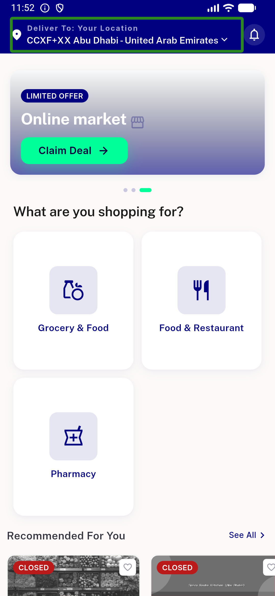
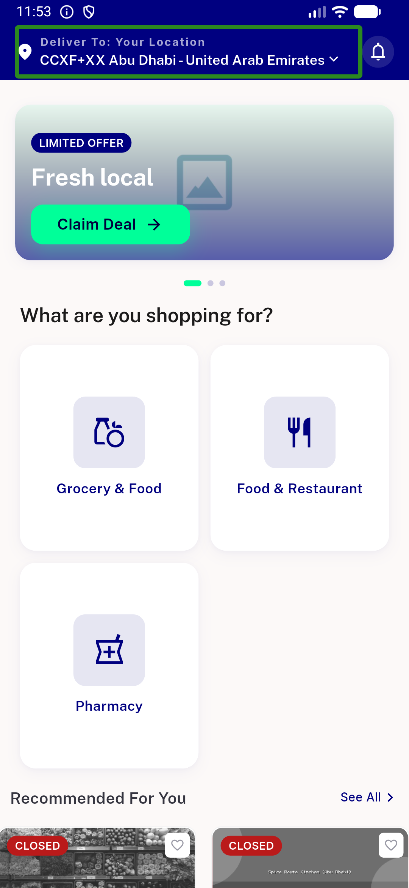
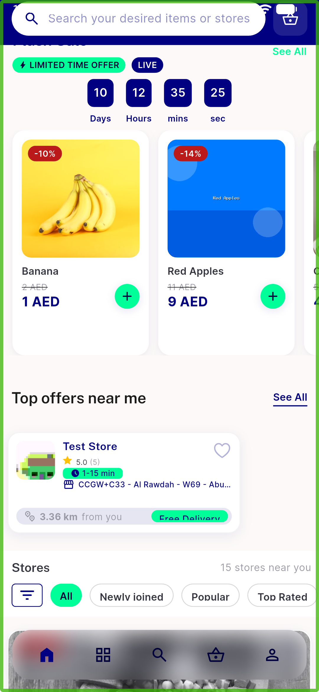
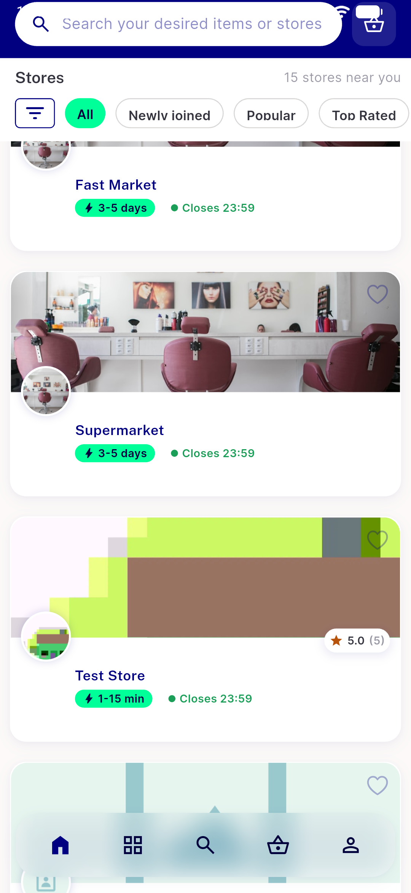
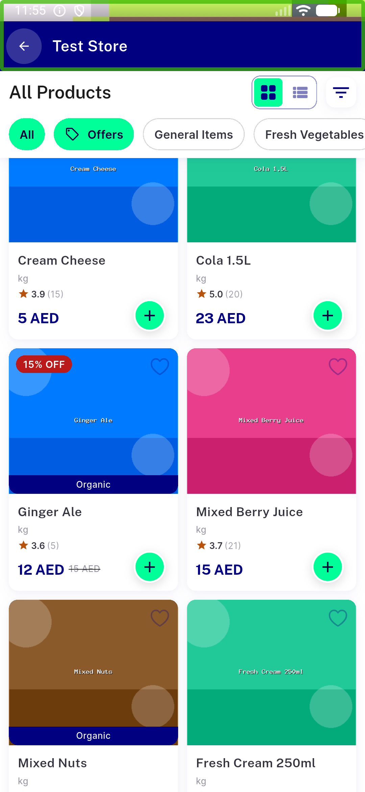
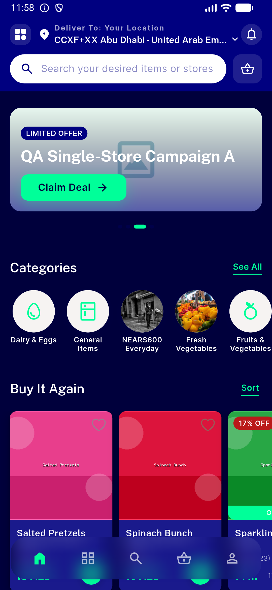
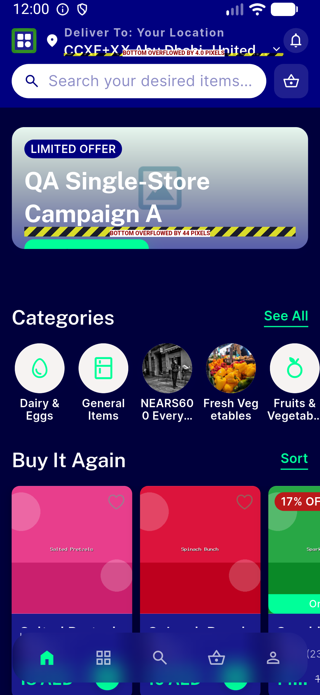

# QA Evidence — NEARS-961

**PASS - grid-card 1px overflow Already-Fixed/CNR @default scale (emulator-5560, 6dae327a)**

**8 screenshot(s).** Click any thumbnail for full resolution.

<table>
<tr>
<td align="center" width="33%"> initial home</td>
<td align="center" width="33%"> guest home abudhabi default scale</td>
<td align="center" width="33%"> guest home scrolled gridcards</td>
</tr>
<tr>
<td align="center" width="33%"> module home itemgrid default scale</td>
<td align="center" width="33%"> module home recommended grid</td>
<td align="center" width="33%"> store page itemgrid</td>
</tr>
<tr>
<td align="center" width="33%"> dark module home itemgrid</td>
<td align="center" width="33%"> fontscale 1.3 guest home</td>
</tr>
</table>

### Other artifacts
- [`bug-fontscale-1.3-nongrid-overflows.log`](bug-fontscale-1.3-nongrid-overflows.log)
- [`bug-signin-branding-1px-overflow.log`](bug-signin-branding-1px-overflow.log)
- [`progress.md`](progress.md)

---
*From `nears/docs/qa-evidence/NEARS-961/` · public-repo scrub policy (no live secrets; verified clean).*
