# QA Evidence — NEARS-963

**FAIL cycle-3 (2-cap override): AC4 rating stars still empty content-desc on BOTH filter sheets; AC5-shape SizedBox(icon-size) does not project on-device. ESCALATE.**

**21 screenshot(s).** Click any thumbnail for full resolution.

<table>
<tr>
<td align="center" width="33%"><a href="ac4-search-stars-after-tap3.png">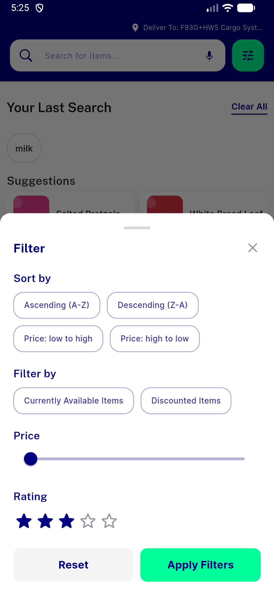</a> ac4 search stars after tap3</td>
<td align="center" width="33%"><a href="ac4-stars-after-tap-c3.png">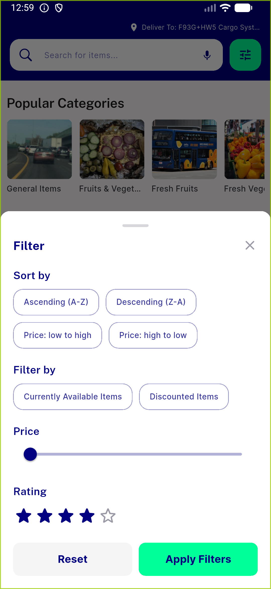</a> ac4 stars after tap c3</td>
<td align="center" width="33%"><a href="ac4-store-filter-stars-empty.png">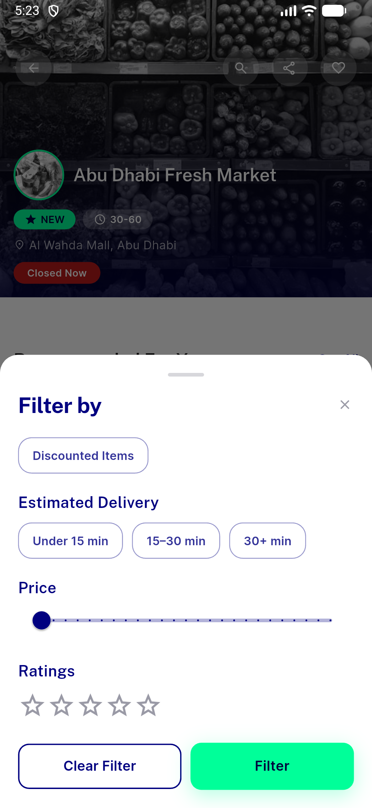</a> ac4 store filter stars empty</td>
</tr>
<tr>
<td align="center" width="33%"><a href="ac4-store-stars-after-tap3.png">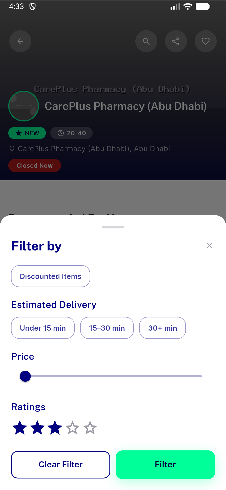</a> ac4 store stars after tap3</td>
<td align="center" width="33%"><a href="ac5-store-toggle-c3.png">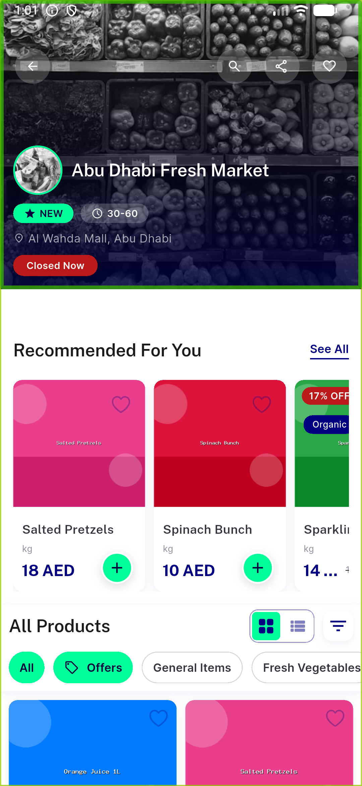</a> ac5 store toggle c3</td>
<td align="center" width="33%"><a href="ac5-store-toggle-list-active.png">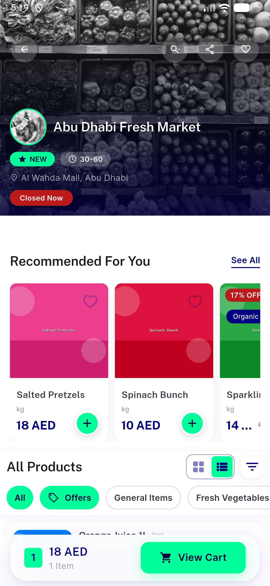</a> ac5 store toggle list active</td>
</tr>
<tr>
<td align="center" width="33%"><a href="ac5-store-toggle.png">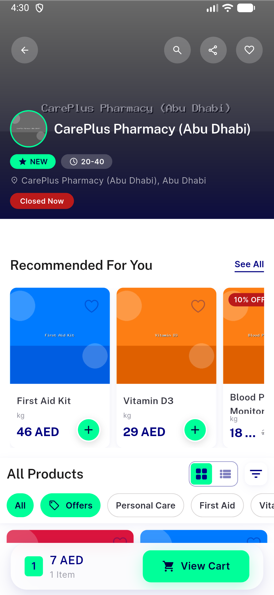</a> ac5 store toggle</td>
<td align="center" width="33%"> ac7 home carousel dots</td>
<td align="center" width="33%"><a href="ac7-home-landing-after-swipe.png">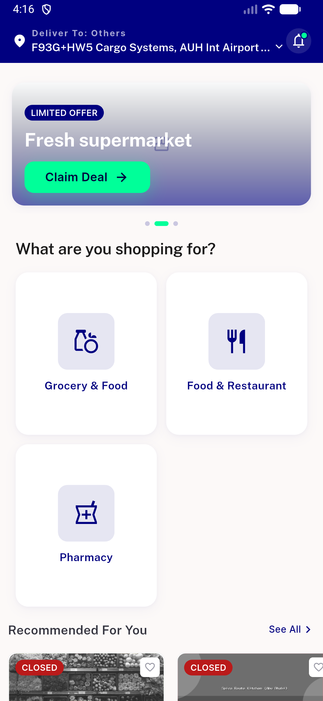</a> ac7 home landing after swipe</td>
</tr>
<tr>
<td align="center" width="33%"> ac7 home landing before</td>
<td align="center" width="33%"><a href="ac9-verified-badge-pass.png">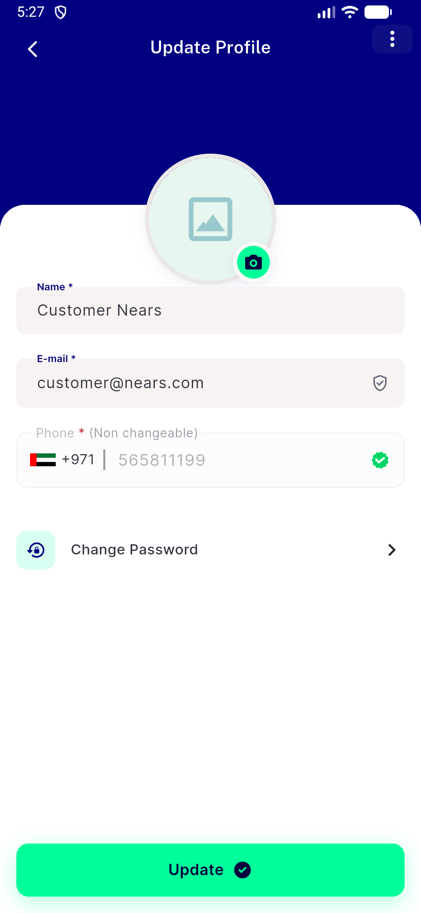</a> ac9 verified badge pass</td>
<td align="center" width="33%"> ac9 verified badge</td>
</tr>
<tr>
<td align="center" width="33%"><a href="bug-map-zoom-no-label-c3.png">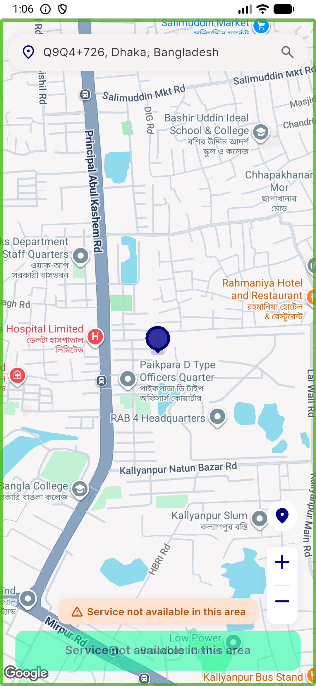</a> bug map zoom no label c3</td>
<td align="center" width="33%"><a href="bug-map-zoom-no-label.png">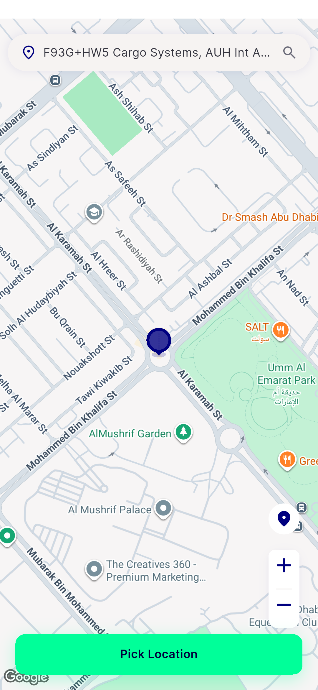</a> bug map zoom no label</td>
<td align="center" width="33%"><a href="bug-rating-stars-no-label-search-filter.png">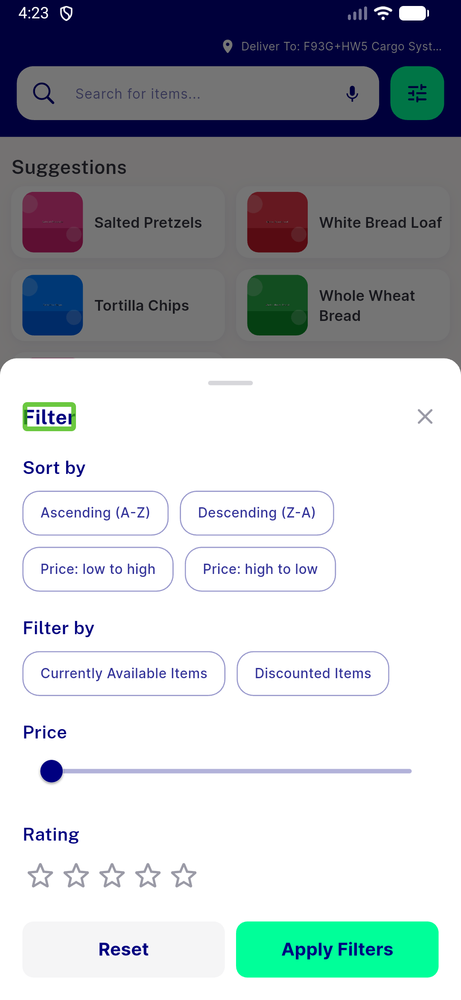</a> bug rating stars no label search filter</td>
</tr>
<tr>
<td align="center" width="33%"><a href="bug-rating-stars-search-filter-c3.png">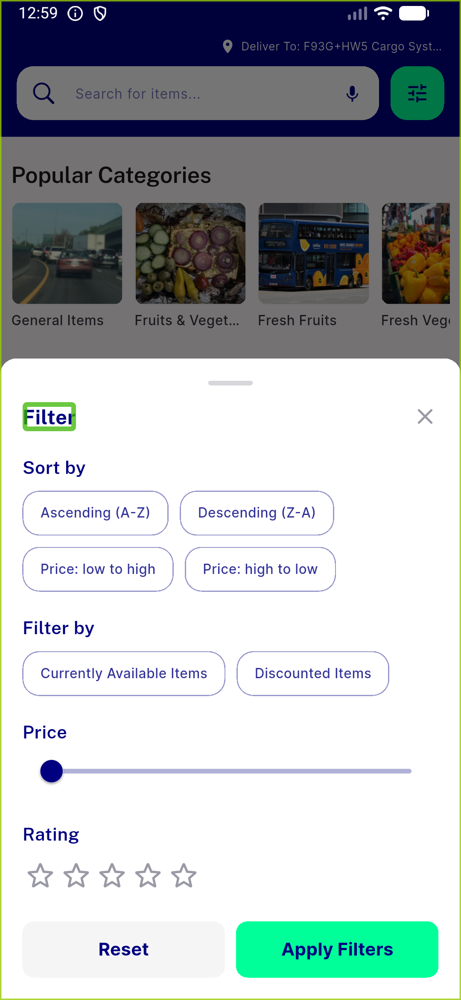</a> bug rating stars search filter c3</td>
<td align="center" width="33%"><a href="bug-rating-stars-search-filter-empty.png">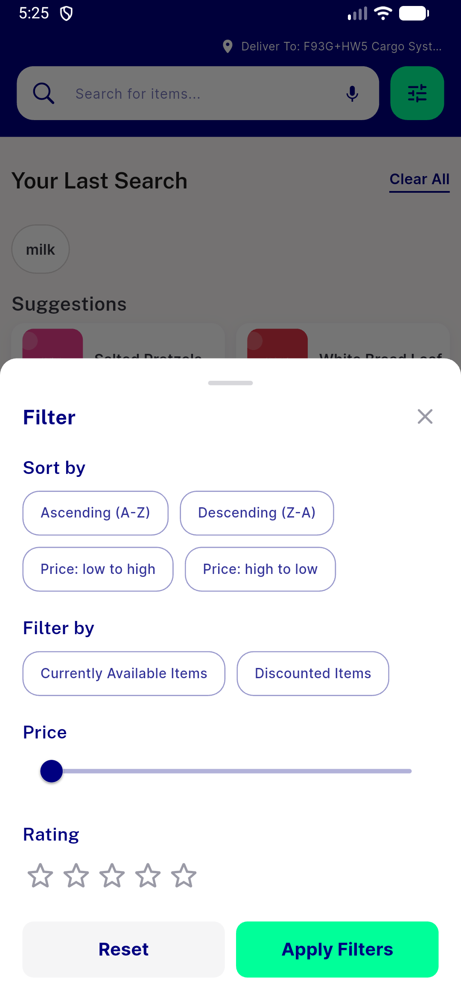</a> bug rating stars search filter empty</td>
<td align="center" width="33%"><a href="bug-rating-stars-store-filter-before.png">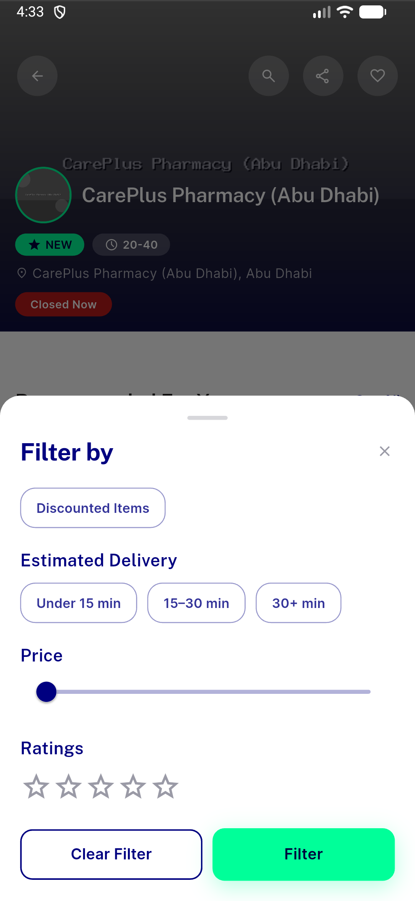</a> bug rating stars store filter before</td>
</tr>
<tr>
<td align="center" width="33%"><a href="bug-rating-stars-store-filter-c3.png">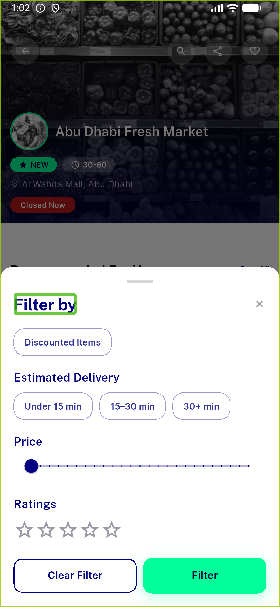</a> bug rating stars store filter c3</td>
<td align="center" width="33%"><a href="c2-ac4-search-filter-stars.png">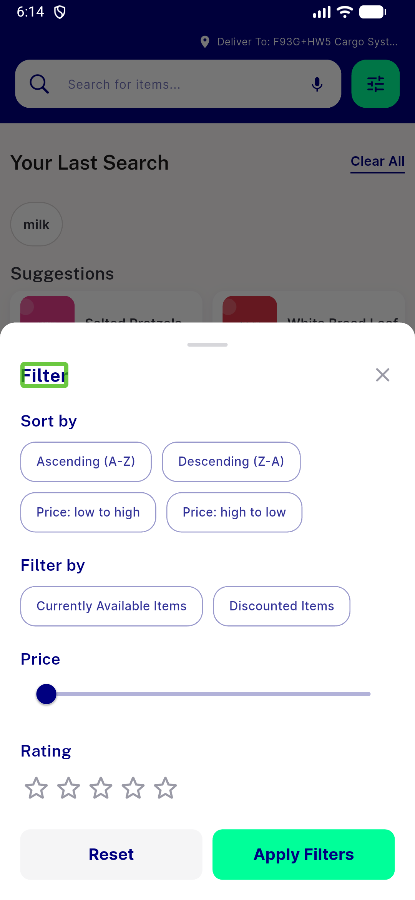</a> c2 ac4 search filter stars</td>
<td align="center" width="33%"><a href="c2-ac4-store-filter-stars.png">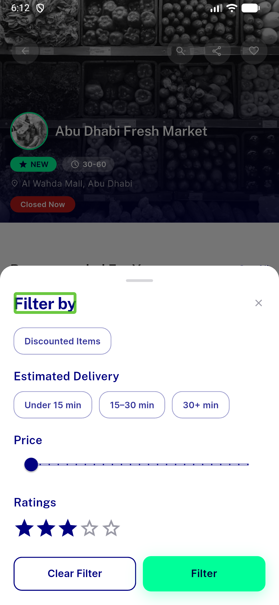</a> c2 ac4 store filter stars</td>
</tr>
</table>

### Other artifacts
- [`bug-ac3-map-zoom-still-empty-cycle1.log`](bug-ac3-map-zoom-still-empty-cycle1.log)
- [`bug-ac4-rating-stars-still-empty-cycle1.log`](bug-ac4-rating-stars-still-empty-cycle1.log)
- [`bug-item-widget-overflow-2px.log`](bug-item-widget-overflow-2px.log)
- [`bug-map-zoom-no-label.log`](bug-map-zoom-no-label.log)
- [`bug-rating-stars-c2-no-label.log`](bug-rating-stars-c2-no-label.log)
- [`bug-rating-stars-no-label.log`](bug-rating-stars-no-label.log)
- [`progress.md`](progress.md)

---
*From `nears/docs/qa-evidence/NEARS-963/` · public-repo scrub policy (no live secrets; verified clean).*
