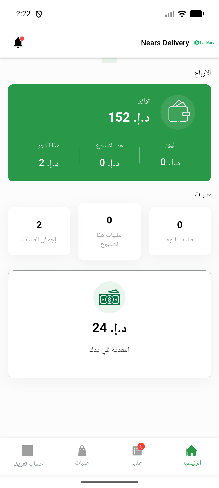
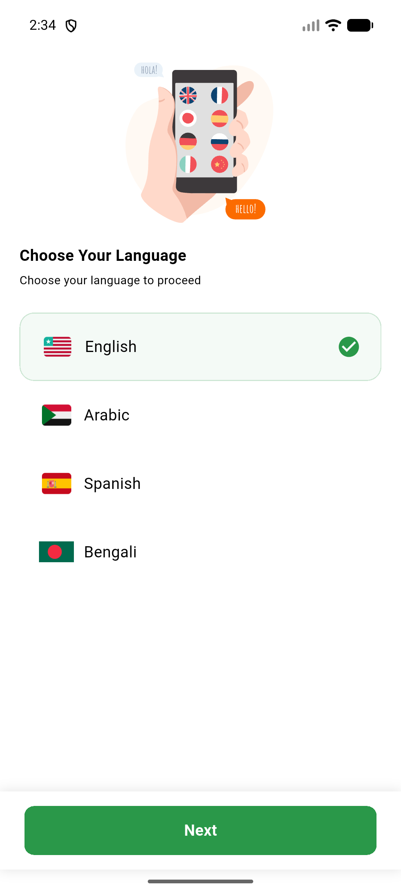

# QA Evidence — NEARS-968

**PASS — DeliveryApp+VendorApp cold-start no [core/no-app] with google-services.json absent; no duplicate-app regression when present; analytics fires**

**4 screenshot(s).** Click any thumbnail for full resolution.

<table>
<tr>
<td align="center" width="33%"> AC1 delivery config absent</td>
<td align="center" width="33%"> AC2 vendor config absent</td>
<td align="center" width="33%"> AC4 delivery config present</td>
</tr>
<tr>
<td align="center" width="33%"> AC4 vendor config present</td>
</tr>
</table>

### Other artifacts
- [`AC1-AC3-delivery-condA.log`](AC1-AC3-delivery-condA.log)
- [`AC2-AC3-vendor-condA.log`](AC2-AC3-vendor-condA.log)
- [`AC4-delivery-analytics-fires.log`](AC4-delivery-analytics-fires.log)
- [`AC4-vendor-analytics-fires.log`](AC4-vendor-analytics-fires.log)

---
*From `nears/docs/qa-evidence/NEARS-968/` · public-repo scrub policy (no live secrets; verified clean).*
