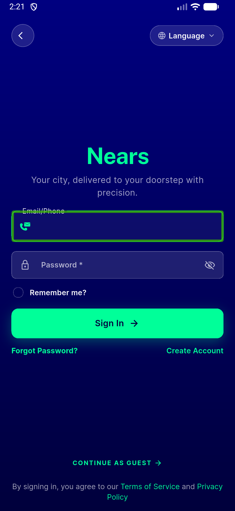
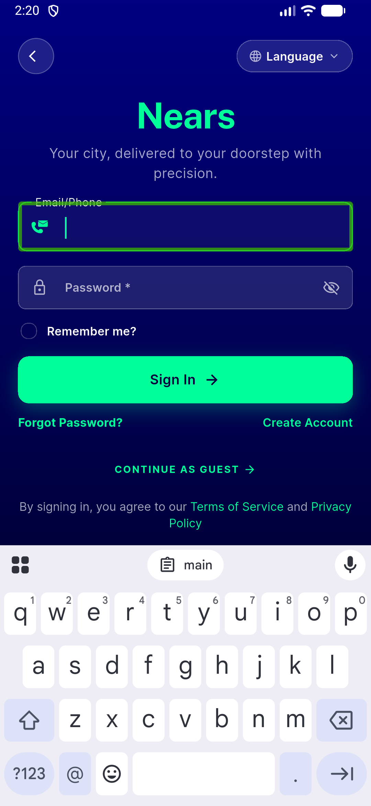
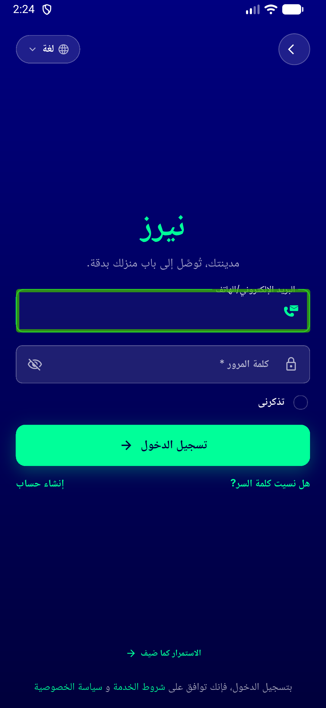
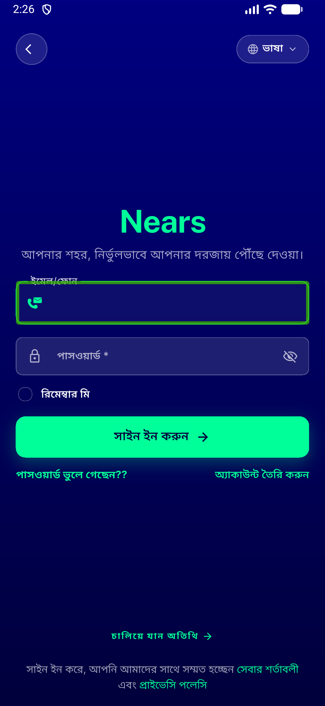
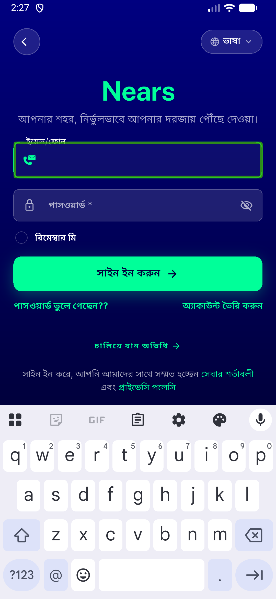

# QA Evidence — NEARS-973

**PASS — sign-in :221 Column, no RenderFlex overflow at default scale (EN/AR/BN); NEARS-411 keyboard scroll intact LTR+RTL**

**6 screenshot(s).** Click any thumbnail for full resolution.

<table>
<tr>
<td align="center" width="33%"> ac1 ac2 signin en resting default scale</td>
<td align="center" width="33%"> ac2 signin en default scale</td>
<td align="center" width="33%"> f1 signin ar resting default scale</td>
</tr>
<tr>
<td align="center" width="33%"> f1 signin bn resting default scale</td>
<td align="center" width="33%"> reg 411 ar keyboard rtl scroll</td>
<td align="center" width="33%"> reg 411 bn keyboard ltr scroll</td>
</tr>
</table>

---
*From `nears/docs/qa-evidence/NEARS-973/` · public-repo scrub policy (no live secrets; verified clean).*
