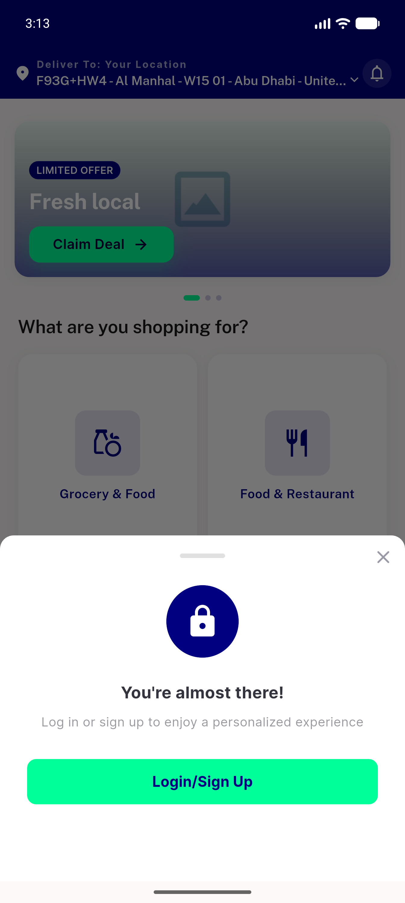
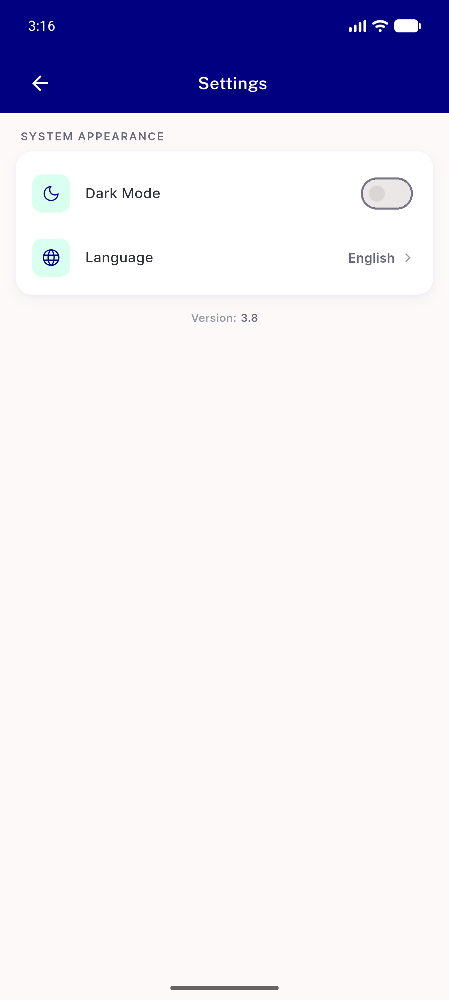
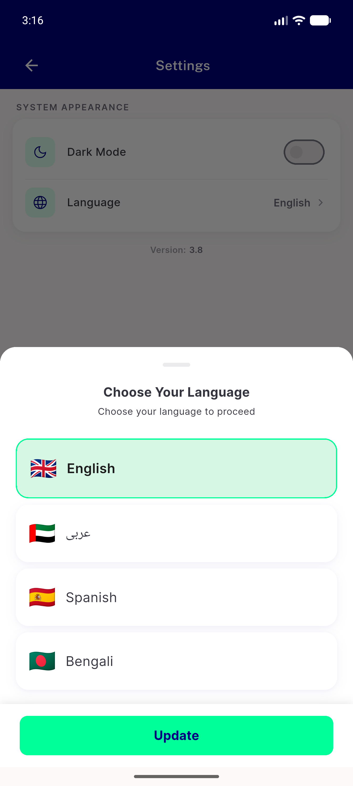
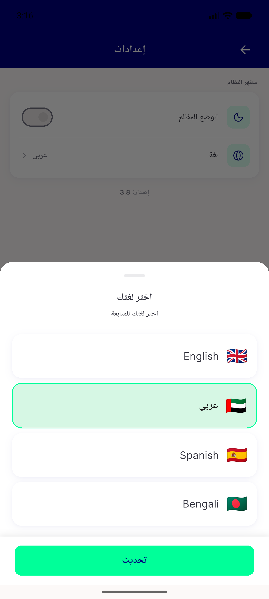
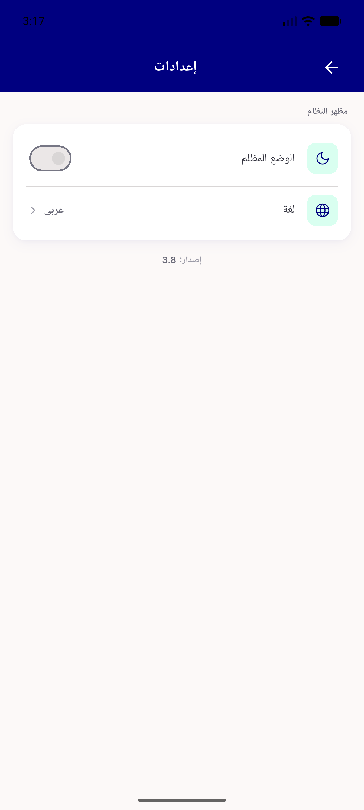
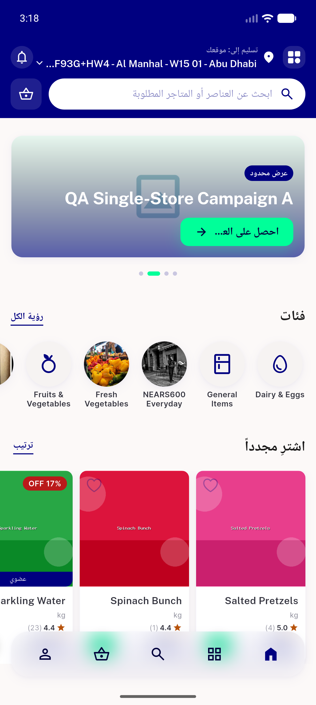
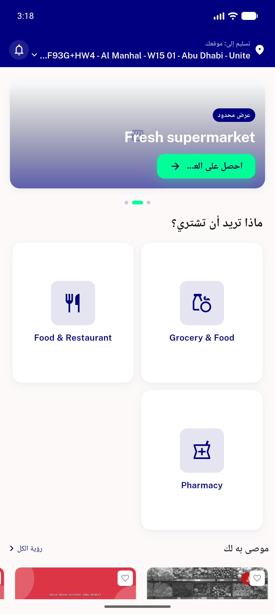
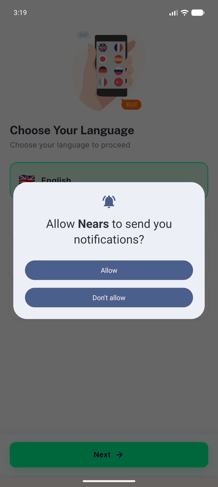

# QA Evidence — NEARS-975

**CANNOT-REPRODUCE: AR locale applies live + persists across force-stop+cold-relaunch on clean device (Pixel_10_Pro_2/5554 wipe-data cold boot)**

**8 screenshot(s).** Click any thumbnail for full resolution.

<table>
<tr>
<td align="center" width="33%"> home english baseline</td>
<td align="center" width="33%"> settings language english</td>
<td align="center" width="33%"> language bottomsheet open</td>
</tr>
<tr>
<td align="center" width="33%"> LIVE switch arabic rtl</td>
<td align="center" width="33%"> settings persisted arabic</td>
<td align="center" width="33%"> home arabic rtl deliverto</td>
</tr>
<tr>
<td align="center" width="33%"> persist after forcestop coldrelaunch</td>
<td align="center" width="33%"> reset to english ltr</td>
</tr>
</table>

---
*From `nears/docs/qa-evidence/NEARS-975/` · public-repo scrub policy (no live secrets; verified clean).*
