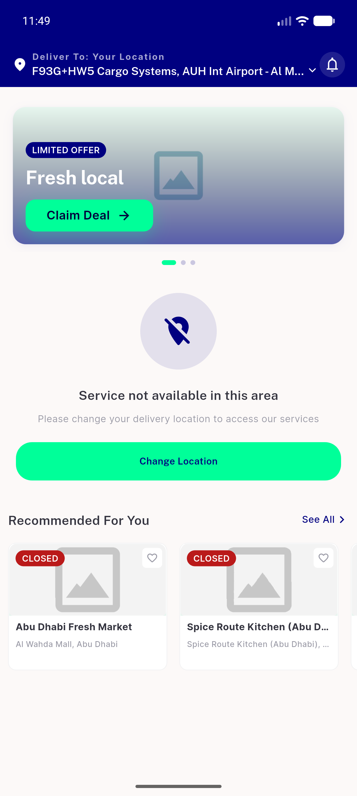
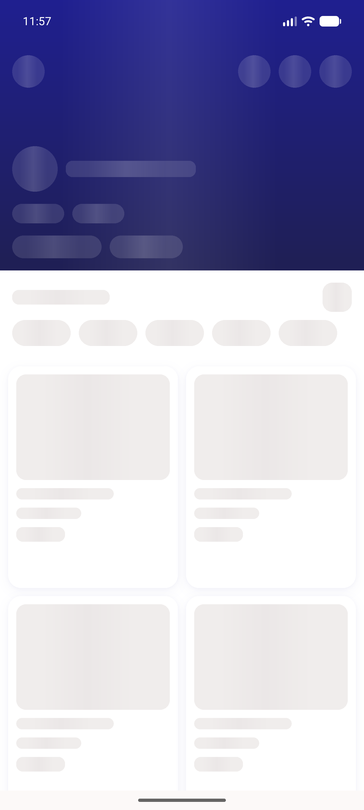
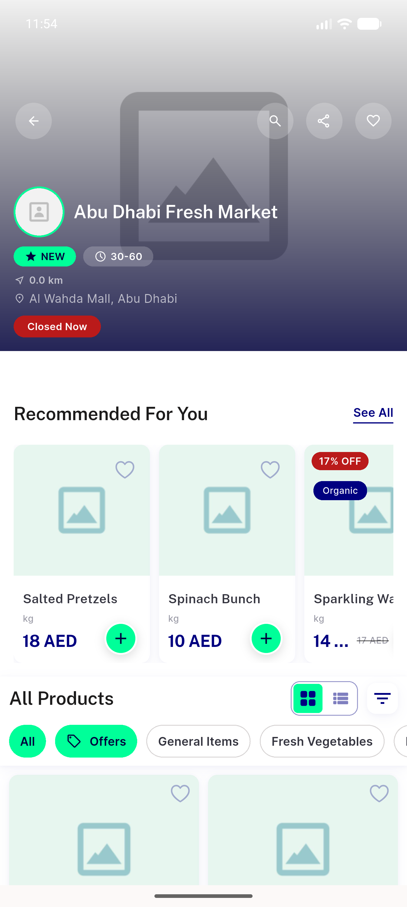
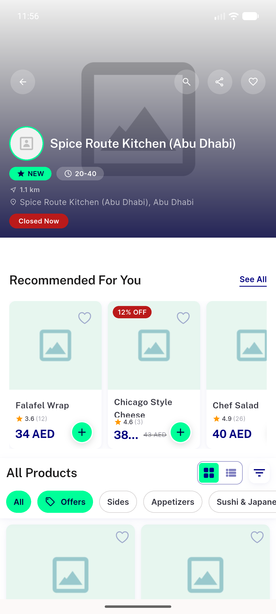
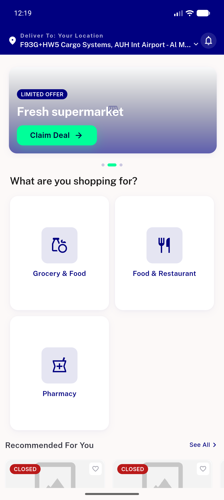

# QA Evidence — NEARS-976

**PASS cycle-2 — featured store-list + banner now send RAW coords (State B) / '' (0,0 address); (0,0) normalization on fixed path confirmed ''; featured 200 no-403; home smoke clean**

**6 screenshot(s).** Click any thumbnail for full resolution.

<table>
<tr>
<td align="center" width="33%"> A1 home allmodules stateA</td>
<td align="center" width="33%"> A2 storedetail stateA nopill</td>
<td align="center" width="33%"> B1 storedetail stateB</td>
</tr>
<tr>
<td align="center" width="33%"> B2 storedetail spice stateB</td>
<td align="center" width="33%"> C2 A home stateA zerozero</td>
<td align="center" width="33%"> C2 B home stateB raw</td>
</tr>
</table>

### Other artifacts
- [`bug-header-helper-jsonencode-unpatched.log`](bug-header-helper-jsonencode-unpatched.log)
- [`cycle2-featured-header-FIXED.log`](cycle2-featured-header-FIXED.log)

---
*From `nears/docs/qa-evidence/NEARS-976/` · public-repo scrub policy (no live secrets; verified clean).*
