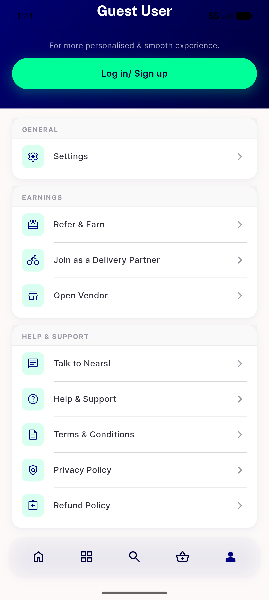

# QA Evidence — NEARS-977

**BLOCKED — top-offers rail cannot reach >=2 stores (top_rated_stores<=1, discounts table empty) + shared-backend contention; 44/44 store_controller tests green; app runs healthy**

**2 screenshot(s).** Click any thumbnail for full resolution.

<table>
<tr>
<td align="center" width="33%"> current state</td>
<td align="center" width="33%"> home food top1</td>
</tr>
</table>

### Other artifacts
- [`blocked-data-and-env-gap.log`](blocked-data-and-env-gap.log)

---
*From `nears/docs/qa-evidence/NEARS-977/` · public-repo scrub policy (no live secrets; verified clean).*
