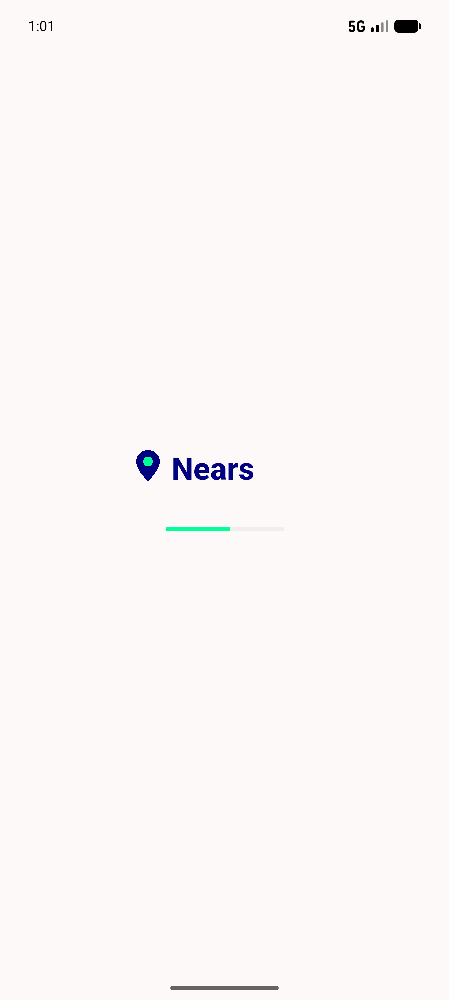
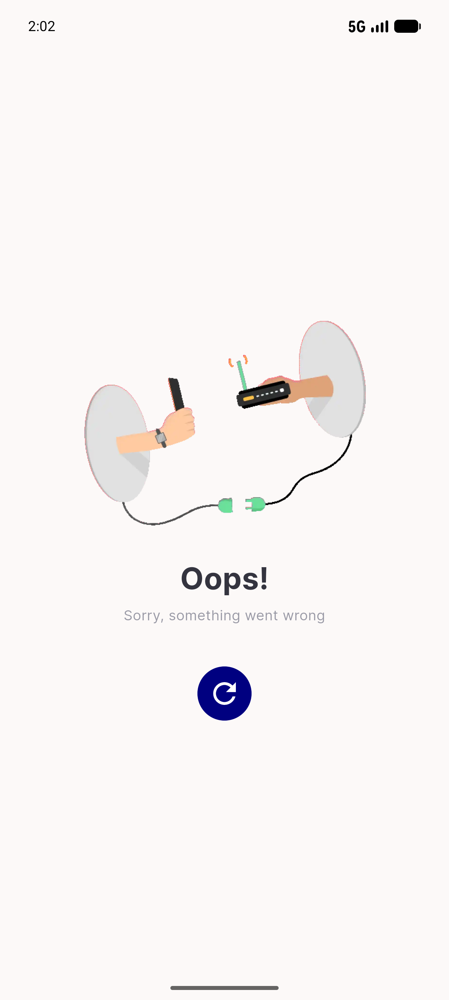
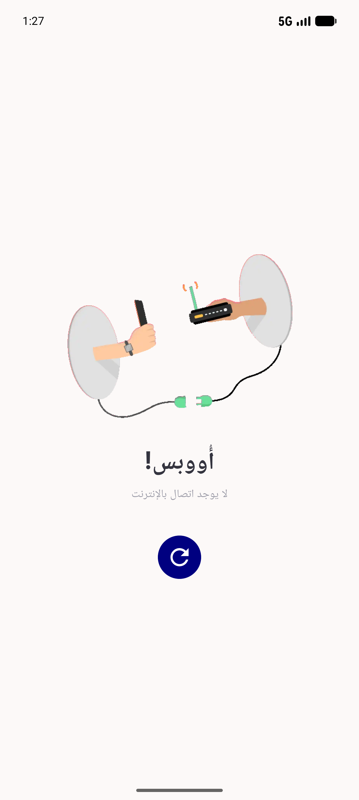
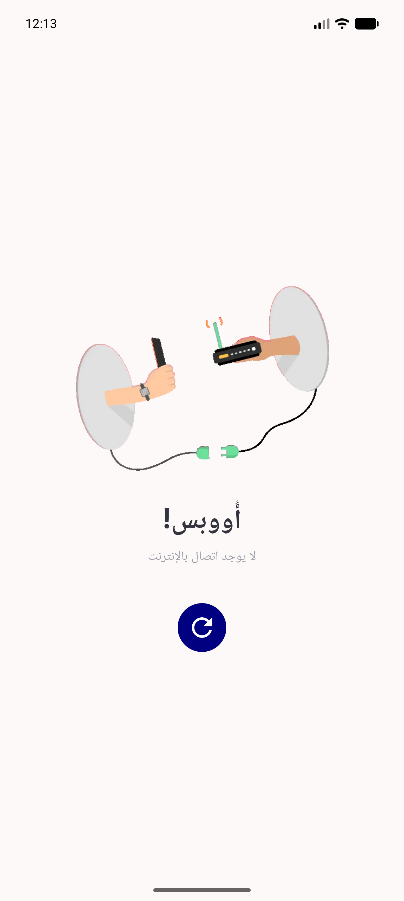
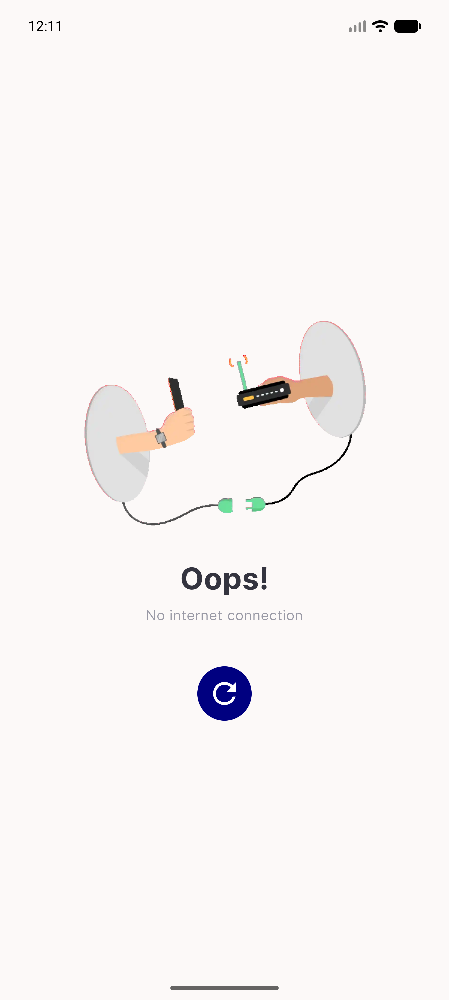
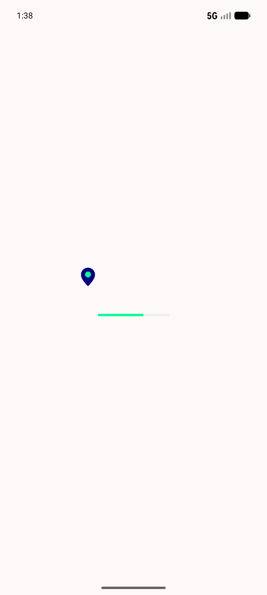

# QA Evidence — NEARS-979

**Delta re-QA (fix cycle 2): AC2/AC4/AC12 FAIL->PASS, 1914/1914 tests green**

**7 screenshot(s).** Click any thumbnail for full resolution.

<table>
<tr>
<td align="center" width="33%"> bug malformed config infinite spinner</td>
<td align="center" width="33%"> requa ac2 malformed generic fixed</td>
<td align="center" width="33%"> splash config error generic ar rtl</td>
</tr>
<tr>
<td align="center" width="33%"> splash config error no internet ar rtl current</td>
<td align="center" width="33%"> splash config error no internet ar rtl</td>
<td align="center" width="33%"> splash config error no internet en</td>
</tr>
<tr>
<td align="center" width="33%"> splash config error timeout ar rtl</td>
</tr>
</table>

### Other artifacts
- [`requa-ac4-retry-midflight-evidence.log`](requa-ac4-retry-midflight-evidence.log)

---
*From `nears/docs/qa-evidence/NEARS-979/` · public-repo scrub policy (no live secrets; verified clean).*
