# QA Evidence — NEARS-batch-345-360

**Batch QA 345/322/342/341/359/360 — 345 FAIL (RangeError), 322 FAIL (RTL overflow)**

**18 screenshot(s).** Click any thumbnail for full resolution.

<table>
<tr>
<td align="center" width="33%"><a href="01-home-guest.png">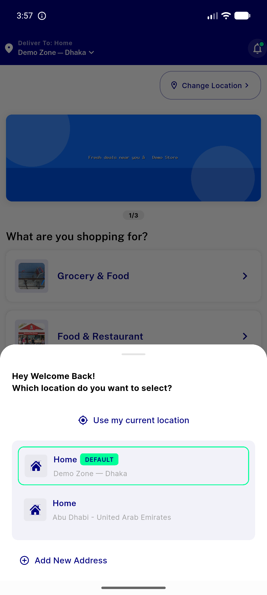</a> home guest</td>
<td align="center" width="33%"><a href="02-fresh-guest-home.png">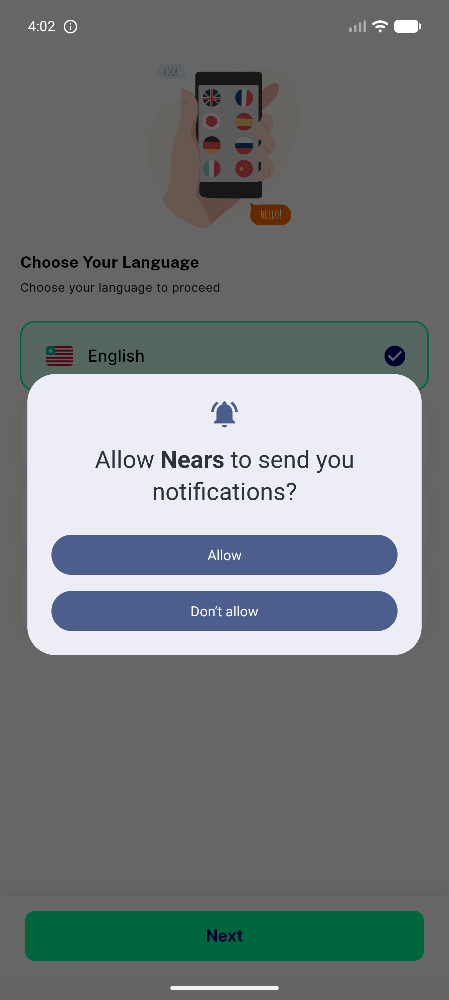</a> fresh guest home</td>
<td align="center" width="33%"><a href="03-guest-home-reached.png">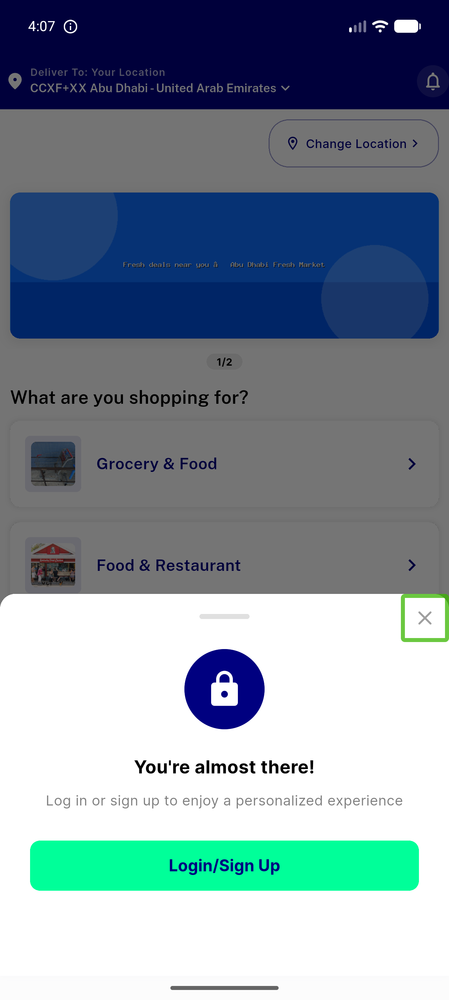</a> guest home reached</td>
</tr>
<tr>
<td align="center" width="33%"><a href="04-nears360-inline-stepper-qty1-qty2.png">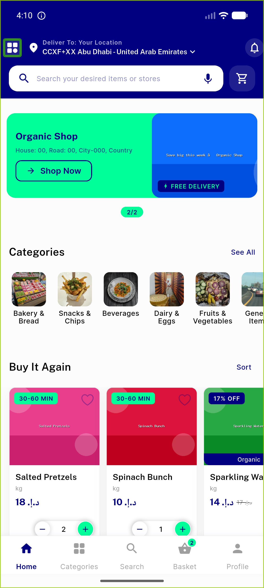</a> nears360 inline stepper qty1 qty2</td>
<td align="center" width="33%"><a href="05-nears360-login-show-password.png">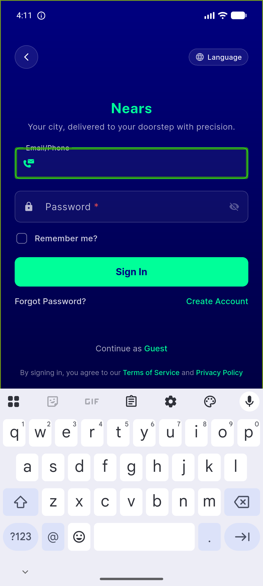</a> nears360 login show password</td>
<td align="center" width="33%"><a href="06-nears360-arabic-rtl-steppers.png">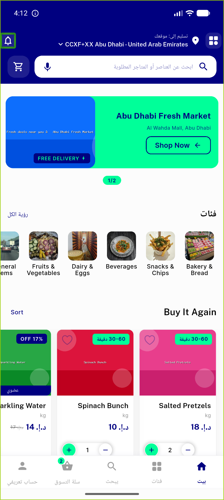</a> nears360 arabic rtl steppers</td>
</tr>
<tr>
<td align="center" width="33%"><a href="07-nears322-rtl-shimmer-refresh.png">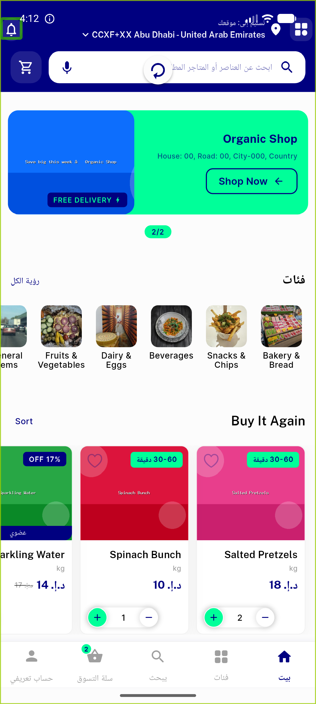</a> nears322 rtl shimmer refresh</td>
<td align="center" width="33%"><a href="08-nears322-OVERFLOW-rtl-shimmer.png">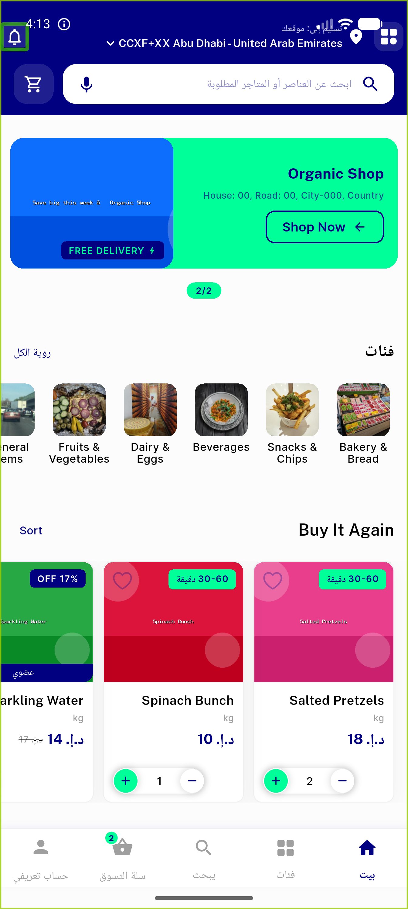</a> nears322 OVERFLOW rtl shimmer</td>
<td align="center" width="33%"><a href="09-nears322-ltr-shimmer.png">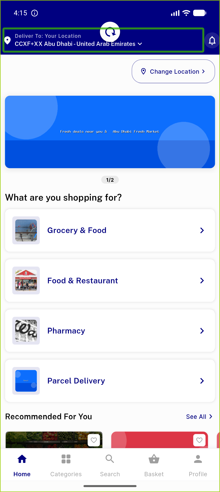</a> nears322 ltr shimmer</td>
</tr>
<tr>
<td align="center" width="33%"><a href="10-nears322-rtl-seeall.png">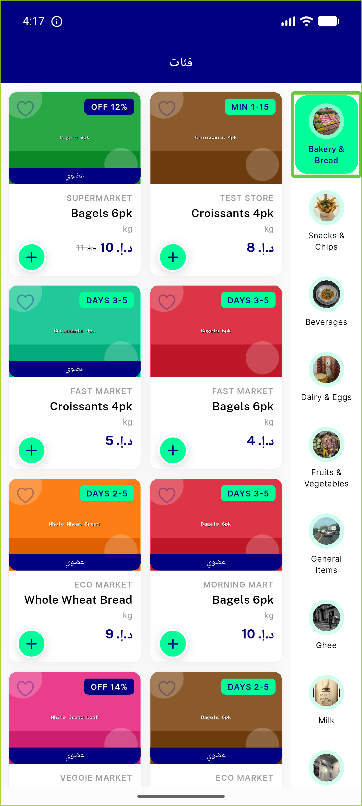</a> nears322 rtl seeall</td>
<td align="center" width="33%"><a href="11-nears322-rtl-coldload.png">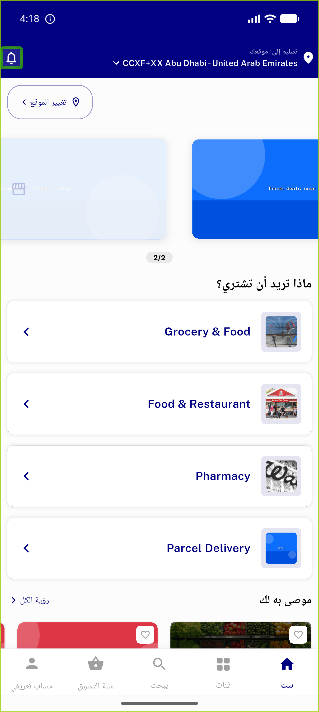</a> nears322 rtl coldload</td>
<td align="center" width="33%"><a href="12-nears341-banner-to-store.png">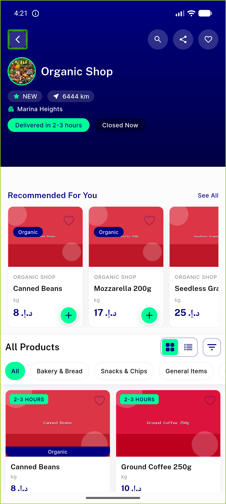</a> nears341 banner to store</td>
</tr>
<tr>
<td align="center" width="33%"><a href="13-nears359-home-rails-scrolled.png">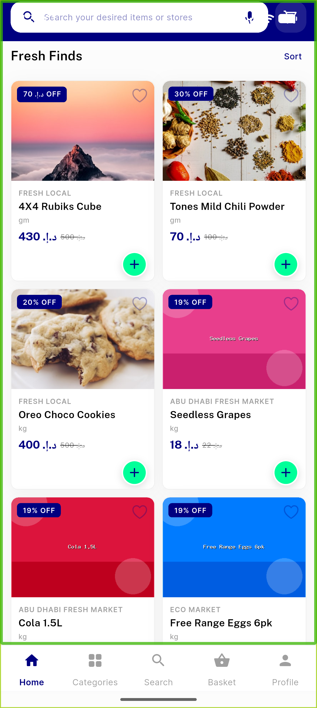</a> nears359 home rails scrolled</td>
<td align="center" width="33%"><a href="14-nears345-review-items-qty2.png">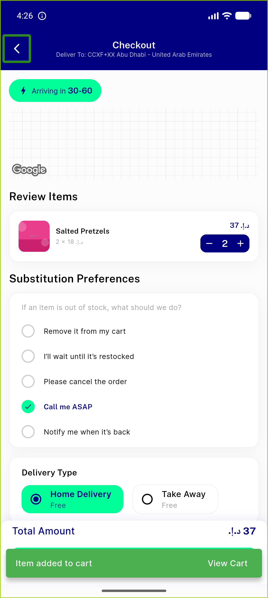</a> nears345 review items qty2</td>
<td align="center" width="33%"><a href="15-nears345-after-decrement-to-qty1.png">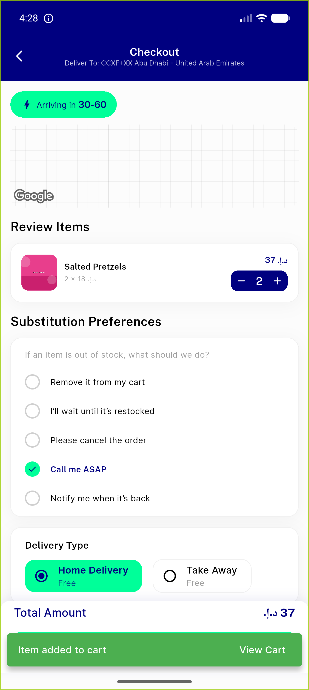</a> nears345 after decrement to qty1</td>
</tr>
<tr>
<td align="center" width="33%"> nears345 reviewitems qty1 before</td>
<td align="center" width="33%"><a href="17-nears345-cart-qty1-before.png">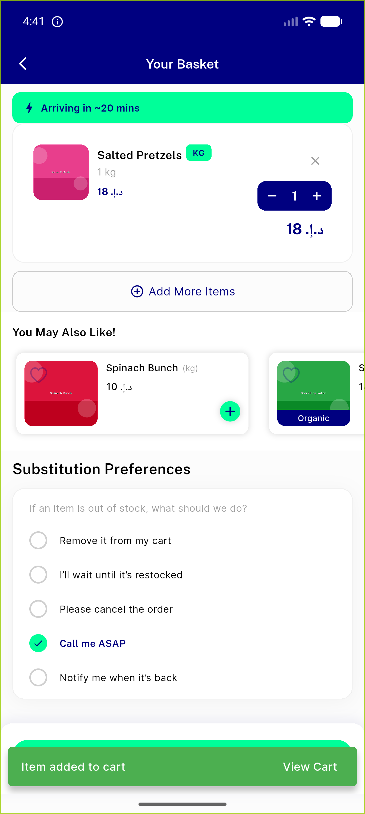</a> nears345 cart qty1 before</td>
<td align="center" width="33%"> nears345 RANGEERROR repro qty1 minus</td>
</tr>
</table>

### Other artifacts
- [`nears345-rangeerror.txt`](nears345-rangeerror.txt)
- [`progress.md`](progress.md)

---
*From `nears/docs/qa-evidence/NEARS-batch-345-360/` · public-repo scrub policy (no live secrets; verified clean).*
