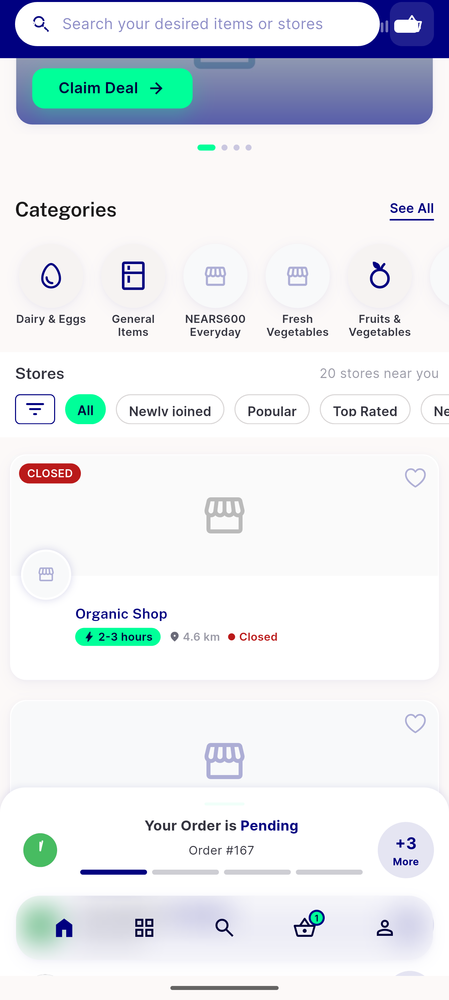
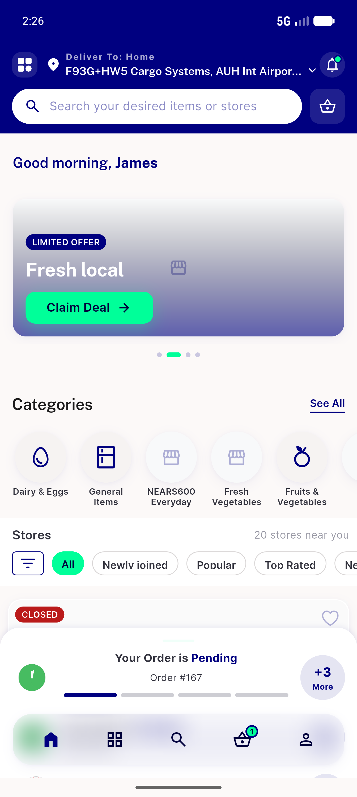
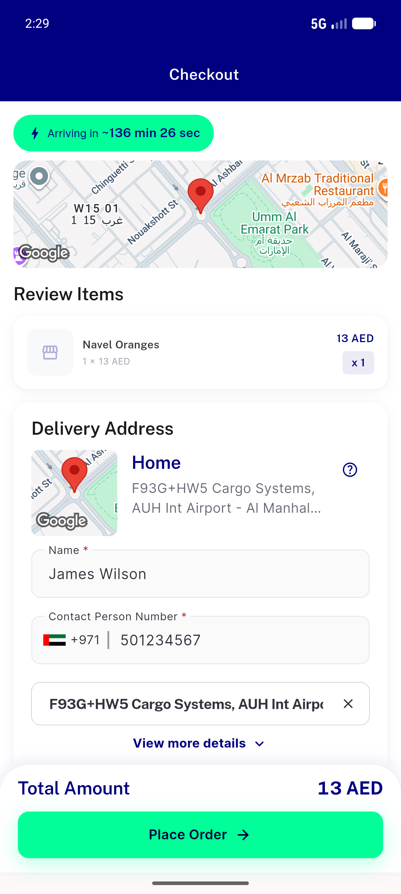
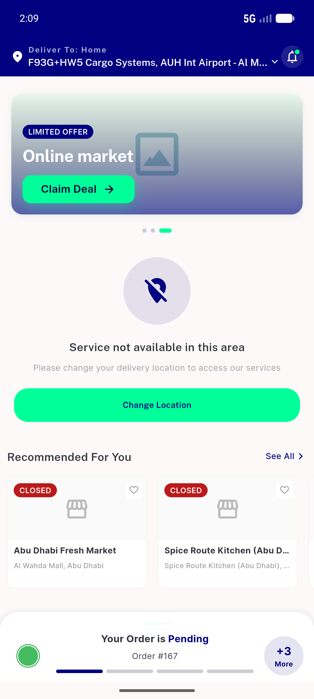
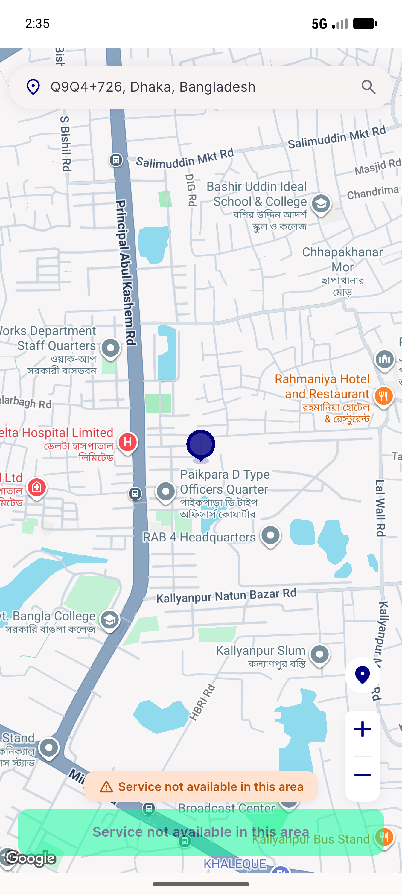

# QA Evidence — NEARS-batch1-logging

**Batch QA: 1081 FAIL(stale tests), 1059 PASS, 1080 PASS — light-mode**

**5 screenshot(s).** Click any thumbnail for full resolution.

<table>
<tr>
<td align="center" width="33%"> ac1a rail transport selfhide</td>
<td align="center" width="33%"> ac1b rail 500 selfhide</td>
<td align="center" width="33%"> checkout straightline pricing</td>
</tr>
<tr>
<td align="center" width="33%"> ac1 out of zone home</td>
<td align="center" width="33%"> ac3 guest picker</td>
</tr>
</table>

### Other artifacts
- [`1059-ac1a-rail-transport-loglines.log`](1059-ac1a-rail-transport-loglines.log)
- [`1059-ac1b-real500-loglines.log`](1059-ac1b-real500-loglines.log)
- [`1080-err-single-line.log`](1080-err-single-line.log)
- [`1081-ac1-out-of-zone-loglines.log`](1081-ac1-out-of-zone-loglines.log)
- [`1081-ac2-transport-fail-loglines.log`](1081-ac2-transport-fail-loglines.log)
- [`1081-ac3-guest-coldboot-loglines.log`](1081-ac3-guest-coldboot-loglines.log)
- [`bug-1081-stale-zone-logging-tests.log`](bug-1081-stale-zone-logging-tests.log)

---
*From `nears/docs/qa-evidence/NEARS-batch1-logging/` · public-repo scrub policy (no live secrets; verified clean).*
